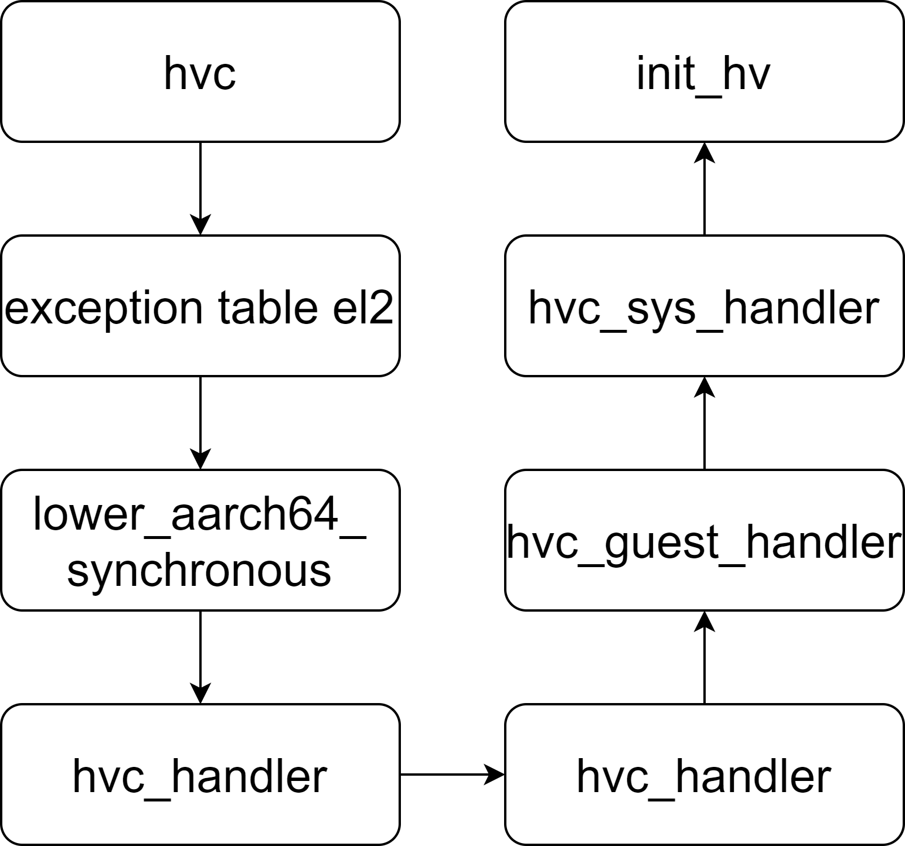
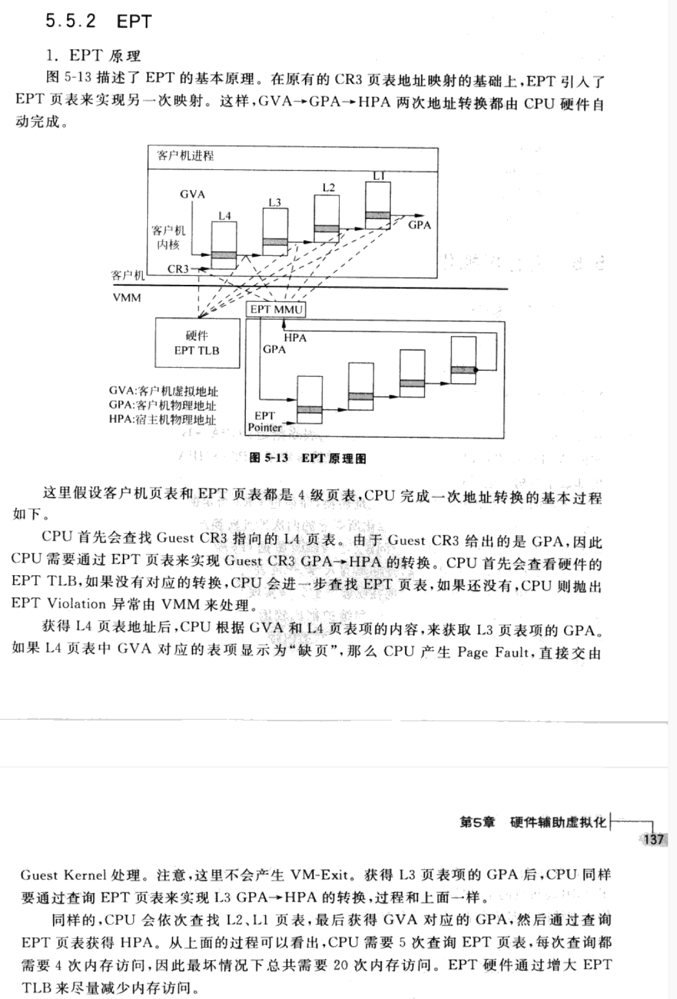

# 解答
## 1.5.2
二型虚拟机，因为是运行于arceos中，并不是直接运行在裸机上。
## 2.4.1
变化的寄存器
- sctlr_el1:系统控制寄存器，用于进行一些系统设置，包括内存系统
  - nTWE, bit [18]
        - 0：如果在 EL0 执行的 WFE 指令会导致执行被暂停，例如事件寄存器未设置且没有待处理的 WFE 唤醒事件，则会使用 0x1 ESR 代码将其视为对EL1 的异常。
        - 1：WFE指令正常运行。
    - nTWI, bit [16]
        - 0：如果在 EL0 执行的 WFI 指令会导致执行被暂停，例如事件寄存器未设置且没有待处理的 WFE 唤醒事件，则会使用 0x1 ESR 代码将其视为对EL1 的异常。
        - 1：WFI指令正常运行。
    - CP15BEN, bit [5]
        - 0：aarch32 CP15 barrier指令禁用，编码为UNDEFINED。
        - 1：aarch32 CP15 barrier指令启用。
    - SA0, bit [4]
        - 当该bit启用时，EL0 的加载/存储指令中堆栈指针作为基地址的使用必须对齐到 16 字节边界，否则将引发堆栈对齐故障异常。
- vtcr_el2：用于设置二阶段页表第二阶段翻译的相关参数
    - PS, bits [18:16]：第二阶段翻译的物理地址大小
    - TG0, bits [15:14]：VTTBR_EL2的页面粒度大小
    - SH0, bits [13:12]：用VTTBR_EL2或VSTTBR_EL2进行table walks时关联的内存的共享属性
    - ORGN0, bits [11:10]：用VTTBR_EL2或VSTTBR_EL2进行table walks时关联的内存的外部缓存属性
    - IRGN0, bits [9:8]：用VTTBR_EL2或VSTTBR_EL2进行table walks时关联的内存的内部缓存属性
    - SL0, bits [7:6]：第二阶段翻译查询的开始级别
    - T0SZ, bits [5:0]：VTTBR_EL2 寻址的内存区域的大小偏移量，区域大小为2^(64-T0SZ)字节。
- hcr_el2：用于进行进行虚拟化的配置，比如设置哪些操作会被trap到EL2。由于目前hypervisor的实现中断控制器也以直通的方式进行虚拟化，所以未设置异常路由到EL2。
    - RW, bit [31]：
        - 0b0：Lower EL都为aarch32。
        - 0b1：在EL1的执行状态为aarch64，EL0的执行状态由PSTATE.nRW当前的值决定。
    - VM, bit [0]：
        - 0b0：禁用EL1&0 二阶段地址翻译。
        - 0b1：启用EL1&0 二阶段地址翻译。
- vmpidr_el2：用于存储虚拟多处理器ID
- x0：存储dtb在内存中的地址，用于之后启动后系统进行读取
- elr(el2)：存储kernel entry point在内存中的地址，使eret后能够直接跳转
- spsr：用于恢复到PSTATE中的信息
  - SPSR_EL1::M::EL1h：设置异常级别为EL1，并且设置由EL确定用的SP是哪个EL。
    - SPSR_EL1::I::Masked：IRQ被屏蔽。
    - SPSR_EL1::F::Masked：FIQ被屏蔽。
    - SPSR_EL1::A::Masked：SError中断被屏蔽。
    - SPSR_EL1:\:D::Masked：目标在当前EL的Watchpoint、Breakpoint 和 Software Step 异常被屏蔽。
## 3.4.1

## 3.4.2
esr_el2的ec会显示为000000，查询文档可知可能的原因：
◦ A read access using a System register pattern that is not allocated for reads or that does not permit reads at the current Exception level and Security state.
◦ A write access using a System register pattern that is not allocated for writes or that does not permit writes at the current Exception level and Security state.
## 3.4.3
略。不知道如何实现的可直接联系老师。
## 4.3.1

参考图中所说，aarch64是3级页表，在gva->gpa的过程中，由于还涉及guest页表gpa->hpa的转换，所以需要处理3×3=9次。最后得到了gpa，gpa->hpa还需要进行第二阶段的3次访存，所以是9+3=12次。
## 4.3.2
直接使用gpm的translate方法即可，需要注意的是一开始未建立映射时会出现HyperError::Internal error，需要进行错误处理。
## 5.3.1
分别修改apps/hv/src/main.rs处理dtb与kernel entry point的相关内容、apps/hv/guest/linux/linux-aarch64.dts中memory节点的reg并重新编译为dtb、以及srcipts/make/qemu.mk 56、57行内容。不能放到0x40000000，因为hypervisor的栈的内存是在这块区域。