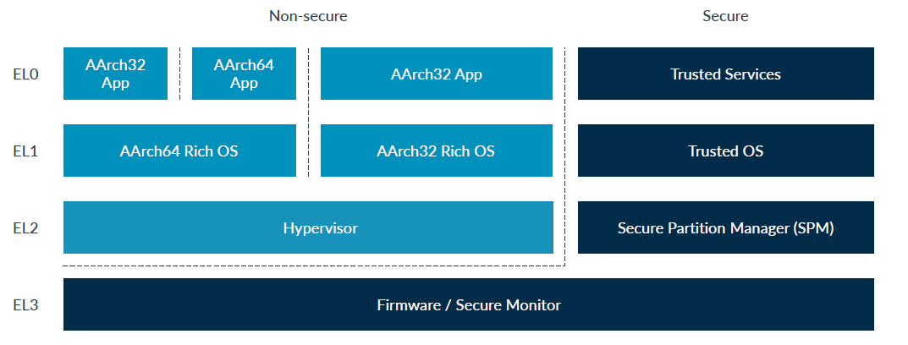
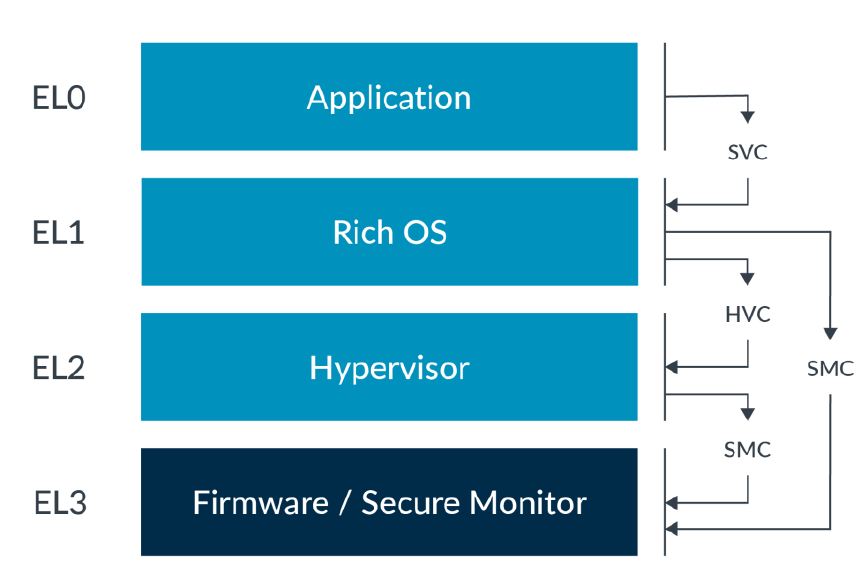

# 1. AARCH64特权等级（异常级别EL）简介与代码整体及运行方法说明
## 1.1 AARCH64异常级别
> 在Arm架构中，当前特权级别只能在处理器发生异常或从异常返回时更改。因此，这些特权级别被称为“异常级别”（Exception levels）。



- 异常级别的切换（系统调用）
  
  - SVC
    - 用于触发一个Supervisor Call Exception，使在EL0特权级的用户程序能够请求EL1特权级的操作系统服务。
  - HVC
    - 用于触发一个Hypervisor Call Exception，使在EL1特权级的操作系统能够请求在EL2特权级的虚拟监控程序提供的服务。
  - SMC
    - 用于触发一个Secure Monitor Call  Exception，使在正常世界（Normal world）能够从EL3特权级的固件请求安全世界（Secure world）提供的服务。
  - ERET
    - 用于异常返回，从当前异常等级返回触发异常前的异常等级。
## 1.2 代码组织结构
- crates/hypercraft/src/aarch64: aarch64 hypercraft的大部分代码，包括Vcpu、VM、CPU、EPT结构的定义，以及异常处理函数与HVC的调用。
- apps/hv/src: 定义了虚拟机启动的main函数，以及相关虚拟机的配置。
- apps/hv/guest: 用于存放guest kernel、dtb等内容。
- modules/axhal/src/arch/aarch64: 用于定义异常处理上下文的结构，以及异常向量表的定义。
- modules/axhal/src/platform/aarch64_common: 定义了arceOS入口函数，并在其中完成一些EL2级别的设置。
- modules/axruntime/src/gpm.rs: 定义了guest page table的相关内容。
- crates/page_table_entry与crates/page_table: 定义了页表相关结构与方法，包括页表描述符等。
## 1.3 建立执行环境
本文档将对基于arceOS的type-2的hypervisor进行说明，该种类型hypervisor不能直接访问硬件，需要依赖于底层OS。arceOS本身的启动与初始化流程在modules/axhal/src/platform/aarch64_common/boot.rs中。
1. 初始化EL2的异常向量表
2. 初始化栈帧
3. 初始化页表以及EL2与EL1的页表基址寄存器，开启MMU
4. 切换到EL1执行系统
## 1.4 运行
假设我们以下操作都是在$(WORKSPACE)目录下进行操作。
### 1.4.1 运行nimbos
#### 编译镜像
1.4.1节运行的OS为[NimbOS](https://github.com/equation314/nimbos)。为了编译这个OS内核，执行以下指令：
```shell
# set up cross-compile tools
# download
wget https://musl.cc/aarch64-linux-musl-cross.tgz
# install
tar zxf aarch64-linux-musl-cross.tgz
# exec below command in bash
export PATH=`pwd`/aarch64-linux-musl-cross/bin:$PATH
# OR add below info in ~/.bashrc
# echo PATH=`pwd`/aarch64-linux-musl-cross/bin:$PATH >> ~/.bashrc

# clone nimbos
git clone https://github.com/equation314/nimbos.git
cd nimbos/kernel

# set up rust tools
make env

# build nimbos
cd ../user && make ARCH=aarch64 build
cd ../kernel && make build ARCH=aarch64 LOG=warn
```
此时会在$(WORKSPACE)/nimbos/kernel/target/aarch64/release下看到编译好的nimbos.bin
#### 运行hypervisor
在qemu中运行arceOS，并在arceOS上起虚拟机。
```shell
# clone arceos
git clone https://github.com/arceos-hypervisor/arceos.git -b hypervisor --recurse-submodules
cd arceos

# move nimbos image to arceos hv 
cp $(WORKSPACE)/nimbos/kernel/target/aarch64/release/nimbos.bin apps/hv/guest/nimbos/nimbos-aarch64.bin

# set up rust tools
cargo install cargo-binutils

# build and run arceos aarch64 hypervisor
make ARCH=aarch64 A=apps/hv HV=y LOG=info GUEST=nimbos run
```
执行上述指令后可以成功看见，能够在命令行输入hello_world，打印出“Hello world from user mode program!”
```shell
d8888                            .d88888b.   .d8888b.
      d88888                           d88P" "Y88b d88P  Y88b
     d88P888                           888     888 Y88b.
    d88P 888 888d888  .d8888b  .d88b.  888     888  "Y888b.
   d88P  888 888P"   d88P"    d8P  Y8b 888     888     "Y88b.
  d88P   888 888     888      88888888 888     888       "888
 d8888888888 888     Y88b.    Y8b.     Y88b. .d88P Y88b  d88P
d88P     888 888      "Y8888P  "Y8888   "Y88888P"   "Y8888P"

arch = aarch64
platform = qemu-virt-aarch64
smp = 1
build_mode = release
log_level = info

[  0.001507 0 axruntime:138] Logging is enabled.
[  0.002006 0 axruntime:139] Primary CPU 0 started, dtb = 0x48000000.
[  0.002167 0 axruntime:144] Found physcial memory regions:
[  0.002318 0 axruntime:146]   [PA:0x40080000, PA:0x40090000) .text (READ | EXECUTE | RESERVED)
[  0.002507 0 axruntime:146]   [PA:0x40090000, PA:0x40094000) .rodata (READ | RESERVED)
[  0.002609 0 axruntime:146]   [PA:0x40094000, PA:0x40097000) .data (READ | WRITE | RESERVED)
[  0.002707 0 axruntime:146]   [PA:0x40097000, PA:0x40098000) .percpu (READ | WRITE | RESERVED)
[  0.002800 0 axruntime:146]   [PA:0x40098000, PA:0x400d8000) boot stack (READ | WRITE | RESERVED)
[  0.002894 0 axruntime:146]   [PA:0x400d8000, PA:0x400fb000) .bss (READ | WRITE | RESERVED)
[  0.002987 0 axruntime:146]   [PA:0x9000000, PA:0x9001000) mmio (READ | WRITE | DEVICE | RESERVED)
[  0.003075 0 axruntime:146]   [PA:0x8000000, PA:0x8020000) mmio (READ | WRITE | DEVICE | RESERVED)
[  0.003169 0 axruntime:146]   [PA:0xa000000, PA:0xa004000) mmio (READ | WRITE | DEVICE | RESERVED)
[  0.003263 0 axruntime:146]   [PA:0x10000000, PA:0x3eff0000) mmio (READ | WRITE | DEVICE | RESERVED)
[  0.003356 0 axruntime:146]   [PA:0x4010000000, PA:0x4020000000) mmio (READ | WRITE | DEVICE | RESERVED)
[  0.003463 0 axruntime:146]   [PA:0x400fb000, PA:0x48000000) free memory (READ | WRITE | FREE)
[  0.003573 0 axruntime:157] Initialize global memory allocator...
[  0.004438 0 axruntime:170] Initialize platform devices...
[  0.004510 0 axruntime:200] Primary CPU 0 init OK.
Hello, hv!
[  0.007543 0 arceos_hv:212] physical memory: [0x70000000: 0x78000000)
[  0.008902 0 arceos_hv:78] vm run cpu0
[  0.009120 0 hypercraft::arch::exception:167] lower_aarch64_synchronous

NN   NN  iii               bb        OOOOO    SSSSS
NNN  NN       mm mm mmmm   bb       OO   OO  SS
NN N NN  iii  mmm  mm  mm  bbbbbb   OO   OO   SSSSS
NN  NNN  iii  mmm  mm  mm  bb   bb  OO   OO       SS
NN   NN  iii  mmm  mm  mm  bbbbbb    OOOO0    SSSSS
              ___    ____    ___    ___
             |__ \  / __ \  |__ \  |__ \
             __/ / / / / /  __/ /  __/ /
            / __/ / /_/ /  / __/  / __/
           /____/ \____/  /____/ /____/

arch = aarch64
platform = qemu-virt-arm
build_mode = release
log_level = warn

Initializing kernel heap at: [0xffff00004010c0e0, 0xffff00004050c0e0)
Initializing frame allocator at: [PA:0x4050d000, PA:0x48000000)
Mapping .text: [0xffff000040080000, 0xffff000040094000)
Mapping .rodata: [0xffff000040094000, 0xffff00004009b000)
Mapping .data: [0xffff00004009b000, 0xffff000040106000)
Mapping .bss: [0xffff00004010a000, 0xffff00004050d000)
Mapping boot stack: [0xffff000040106000, 0xffff00004010a000)
Mapping physical memory: [0xffff00004050d000, 0xffff000048000000)
Mapping MMIO: [0xffff000009000000, 0xffff000009001000)
Mapping MMIO: [0xffff000008000000, 0xffff000008020000)
Initializing drivers...
Initializing task manager...
/**** APPS ****
cyclictest
exit
fantastic_text
forktest
forktest2
forktest_simple
forktest_simple_c
forktree
hello_c
hello_world
matrix
sleep
sleep_simple
stack_overflow
thread_simple
user_shell
usertests
yield
**************/
Running tasks...
test kernel task: pid = TaskId(2), arg = 0xdead
test kernel task: pid = TaskId(3), arg = 0xbeef
Rust user shell
>>
```
### 1.4.2 运行linux
#### 编译linux镜像
1.4.2节运行的系统为linux。为了编译这个OS内核，执行以下指令：
```shell
# set up cross-compile tools
# download
wget https://musl.cc/aarch64-linux-musl-cross.tgz
# install
tar zxf aarch64-linux-musl-cross.tgz
# exec below command in bash
export PATH=`pwd`/aarch64-linux-musl-cross/bin:$PATH
# OR add below info in ~/.bashrc
# echo PATH=`pwd`/aarch64-linux-musl-cross/bin:$PATH >> ~/.bashrc

# download and unzip linux kernel
wget https://git.kernel.org/pub/scm/linux/kernel/git/stable/linux.git/snapshot/linux-6.2.15.tar.gz
tar -xvf linux-6.2.15.tar.gz
cd linux-6.2.15

# build linux
mkdir build
make O=build ARCH=arm64 CROSS_COMPILE=aarch64-linux-musl- defconfig
make O=build ARCH=arm64 CROSS_COMPILE=aarch64-linux-musl- #-j4 
```
#### 构建文件系统
```shell
# use busybox to build rootfs
# download
wget https://busybox.net/downloads/busybox-1.36.1.tar.bz2
tar xvf busybox-1.36.1.tar.bz2

# compile busybox
cd busybox-1.36.1
mkdir build
make O=build ARCH=arm64 defconfig
make O=build ARCH=arm64 menuconfig
## select and save the following settings
## Settings -> [*] Don't use /usr
## Settings -> [*] Build static binary (no shared libs)
## Settings -> (aarch64-linux-musl-) Cross compiler prefix
make O=build #-j4
make O=build install

# build rootfs
cd build/_install && mkdir -pv {etc,proc,sys,dev,usr/{bin,sbin}}
cd ..
## create a image
dd if=/dev/zero of=rootfs.img bs=1M count=512 
## format filesystem
mkfs.ext4 rootfs.img
## mount filesystem
mkdir tmp
sudo mount rootfs.img tmp
## copy and create the content of the filesystem to mount point
sudo cp -r _install/* tmp/
cd tmp/dev
sudo mknod console c 5 1
sudo mknod null c 1 3
sudo mknod tty1 c 4 1 
sudo mknod tty2 c 4 1 
sudo mknod tty3 c 4 1 
sudo mknod tty4 c 4 1 
## create /etc/fstab
cd ../etc
sudo vim fstab
## copy following content to fstab
proc     /proc                   proc     defaults        0 0
sysfs    /sys                    sysfs    defaults        0 0
## create /etc/init.d/rcS
sudo mkdir init.d && cd init.d
sudo vim rcS
## copy following content to rcS
#!/bin/sh
echo -e "Welcome to arceos Linux"
mount -a
echo -e "Remounting the root filesystem"
## create /etc/inittab
cd ..
sudo vim inittab
## copy following content to inittab
# /etc/inittab
::sysinit:/etc/init.d/rcS
console::respawn:-/bin/sh
::ctrlaltdel:/sbin/reboot
::shutdown:/bin/umount -a -r
## umount filesystem
cd ../../
sudo umount tmp
```
#### 运行hypervisor
在qemu中运行arceOS，并在arceOS上起虚拟机。
```shell
# clone arceos
git clone https://github.com/arceos-hypervisor/arceos.git -b hypervisor --recurse-submodules
cd arceos

# move linux image and rootfs to arceos hv 
cp $(WORKSPACE)/linux-6.2.15/build/arch/arm64/boot/Image $(WORKSPACE)/arceos/apps/hv/guest/linux/linux-aarch64.bin
cp $(WORKSPACE)/busybox-1.36.1/build/rootfs.img $(WORKSPACE)/arceos/apps/hv/guest/linux/rootfs-aarch64.img

# set up rust tools
cargo install cargo-binutils

# build and run arceos aarch64 hypervisor
make ARCH=aarch64 A=apps/hv HV=y LOG=info run
```
启动后即可进入linux系统。
## 1.5 练习
1. 根据1.4节在arceos中运行nimbos
2. 阅读[Armv8-A Virtualization](https://developer.arm.com/-/media/Arm%20Developer%20Community/PDF/Learn%20the%20Architecture/Armv8-A%20virtualization.pdf?revision=a765a7df-1a00-434d-b241-357bfda2dd31) Chapter 2（共4页），回答hypercraft是哪一种hypervisor。