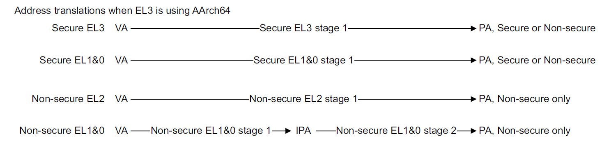
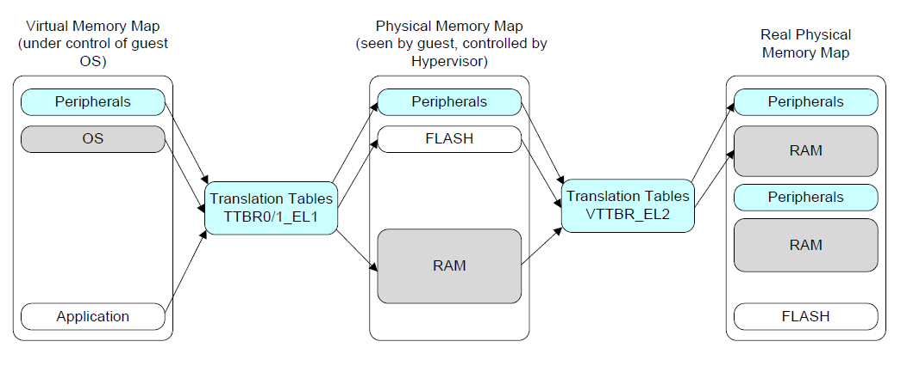

# 4. 内存虚拟化介绍与实现
## 4.1 AARCH64内存虚拟化

- 上图展示了aarch64架构下的各种翻译类型，我们内存虚拟化用到了最后一行的VA→IPA→PA的流程。具体如下图所示。

处理器在EL1或EL0特权级下运行时，地址转换机制由操作系统（OS）设置和控制。在没有虚拟化的系统中，此机制用于将虚拟地址转换为物理地址。在虚拟化系统中，第一阶段会将Guest Virtual Address(GPA)转换为Intermediate Physical Address（IPA），因为它随后会将IPA转换为Host Physical Address(HPA)，即第2阶段（Stage 2）的转换。
- 涉及的相关寄存器：
  - TTBR0_EL1，TTBR1_EL1，TCR_EL1：该部分寄存器由guest OS负责设置，guest负责第一阶段的翻译。其中TTBR0_EL1与TTBR1_EL1为页表基址寄存器，TCR_EL1用于对翻译过程进行一些配置，如地址空间大小、页面大小等。
  - VTTBR_EL2，VTCR_EL2：该部分寄存器由hypervisor负责设置，hypervisor负责第二阶段的翻译。其中VTTBR_EL2为第二阶段页表基址寄存器，VTCR_EL2用于对翻译过程进行配置，如地址空间大小、页面大小等。
## 4.2 代码实现
### 4.2.1 (aarch64) NestedPageTable （crates/hypercraft/src/arch/aarch64/ept.rs）
```rust
pub struct A64HVPagingMetaData;

impl PagingMetaData for A64HVPagingMetaData {
    const LEVELS: usize = 3;
    const PA_MAX_BITS: usize = 48;  // In Armv8.0-A, the maximum size for a physical address is 48 bits.

                                    // The size of the IPA space can be configured in the same way as the 
    const VA_MAX_BITS: usize = 36;  //  virtual address space. VTCR_EL2.T0SZ controls the size.
}
/// According to rust shyper, AArch64 translation table.
pub type NestedPageTable<I> = PageTable64<A64HVPagingMetaData, A64PTE, I>;
```
- PageTable64 (基于arceos的页表，定义于crates/page_table/src/bi64.rs)
  - 成员变量上定义了根物理地址，以及对应的页表映射数组。
  - 方法上定义了新建页表、返回根地址、映射、取消映射、根据虚拟地址查询物理地址以及页表权限、遍历。
- A64HVPagingMetaData （实现了PagingMetaData  trait，实现于crates/hypercraft/src/arch/aarch64/ept.rs）
  - LEVELS：定义有3级页表。
  - PA_MAX_BITS：定义物理地址最大有48位。
  - VA_MAX_BITS：定义虚拟地址最大有36位。
- A64PTE （基于arceos aarch64的页表项，定义于crates/page_table_entry/src/arch/aarch64.rs）
  - 成员变量上定义了PHYS_ADDR_MASK（用于在页表描述符中获取Physical Address）
  - 方法上定义了新建页面、新建页表、获取权限Flag等，使其能够在PageTable64进行映射、取消映射、查询、遍历等方法时进行调用。
  - **注：在页表描述符中需要注意，第一阶段和第二阶段翻译的部分Flag赋值会不同，例如AP bit，需要根据阶段选择正确的赋值，可在官方文档进行查询。**
- I （PagingIf，在具体执行过程，被实例化为GuestPagingIfImpl，即为PagingIfImpl，该结构定义于modules/axhal/src/paging.rs）
  - 定义了分配页帧、回收页帧等方法
### 4.2.2 GuestPageTable (modules/axruntime/src/gpm.rs)
```rust
pub struct GuestPageTable(NestedPageTable<GuestPagingIfImpl>);
```
利用GuestPagingIfImpl对NestedPageTable进行实例化，主要用于guest页表的创建、映射、查询等功能。
- fn new() -> HyperResult\<Self\>
  - 调用PageTable64的try_new()方法进行页表内存分配
- fn map( &mut self, gpa: GuestPhysAddr, hpa: hypercraft::HostPhysAddr, flags: MappingFlags) -> HyperResult<()>
  - 调用PageTable64的map()方法在gpt建立映射条目
- fn unmap(&mut self, gpa: GuestPhysAddr) -> HyperResult<()>
  - 调用PageTable64的unmap()方法取消该区域的映射
- fn translate(&self, gpa: GuestPhysAddr) -> HyperResult\<hypercraft::HostPhysAddr\>
  - 调用PageTable64的query()方法查询gpa对应的hpa
- fn token(&self) -> usize
  - 返回页表基址，用于后续存储至第二阶段页表基址寄存器
## 4.3 练习
1. 假设在 guest OS 中启用了 3 级页表，如果 guest 的一次访存 (使用 guest 虚拟地址) 发生了 TLB 缺失，请问以aarch64 stage2 translation的方法实现内存虚拟化时，最多会导致多少次内存访问？(均为 3 级页表)
2. 在apps/hv/src/main.rs的set_gpm函数中，打印建立地址映射前后查询ipa的结果。（进阶练习，可选）