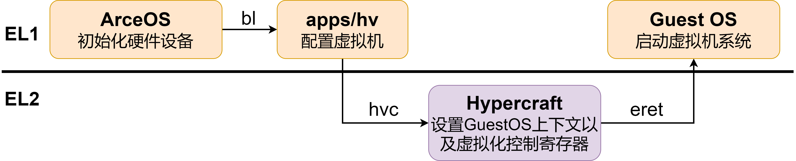

# 5. 启动流程详解
下图展示了启动虚拟机的整体流程。ArceOS运行在EL1，会进行一些硬件寄存器相关的初始化。后续会跳转到apps/hv的main函数执行配置虚拟机的相关程序。配置完成后会调用hvc，进入EL2，进行具体的寄存器配置。最后会通过eret返回EL1，并且跳转到guest的kernel entry执行guest os。具体启动代码细节如下文所示。

## 5.1 ArceOS初始化 (axhal与axruntime)
### 5.1.1 _start() （modules/axhal/src/platform/aarch64_common/boot.rs）
```rust
...
core::arch::asm!("
        ldr x8, ={exception_vector_base_el2}    // setup vbar_el2 for hypervisor
        msr vbar_el2, x8
        
        mrs     x19, mpidr_el1
        and     x19, x19, #0xffffff     // get current CPU id
        mov     x20, x0                 // save DTB pointer
        adrp    x8, {boot_stack}        // setup boot stack
        add     x8, x8, {boot_stack_size}
        mov     sp, x8

        bl      {init_boot_page_table}
        bl      {init_mmu_el2}
        bl      {init_mmu}              // setup MMU
        bl      {switch_to_el1}         // switch to EL1
        bl      {enable_fp}             // enable fp/neon

        mov     x8, {phys_virt_offset}  // set SP to the high address
        add     sp, sp, x8

        mov     x0, x19                 // call rust_entry(cpu_id, dtb)
        mov     x1, x20
        ldr     x8, ={entry}
        blr     x8
        b      .",
        exception_vector_base_el2 = sym exception_vector_base_el2,
        init_boot_page_table = sym init_boot_page_table,
        init_mmu_el2 = sym init_mmu_el2,
        switch_to_el1 = sym switch_to_el1,
        init_mmu = sym init_mmu,
        enable_fp = sym enable_fp,
        boot_stack = sym BOOT_STACK,
        boot_stack_size = const TASK_STACK_SIZE,
        phys_virt_offset = const axconfig::PHYS_VIRT_OFFSET,
        entry = sym crate::platform::rust_entry,
        options(noreturn),
    );
...
```
- 首先启动在EL2，将异常向量表基址存储于VBAR_EL2中
- 获取现在正在运行的CPU id，并初始化CPU启动的栈
- 执行下面的一系列初始化函数
- 更新栈，移动到高地址处。此处由于EL2无法启用TTBR1_EL2进行高地址的翻译，为了之后在触发HVC异常时能够正确跳转到EL2的异常向量表基址，故此处目前实现还是在低地址
- 跳转到rust_entry执行
#### init_boot_page_table（modules/axhal/src/platform/qemu_virt_aarch64/mem.rs）
```rust
pub(crate) unsafe fn init_boot_page_table(
    boot_pt_l0: &mut [A64PTE; 512],
    boot_pt_l1: &mut [A64PTE; 512],
) {
    // 0x0000_0000_0000 ~ 0x0080_0000_0000, table
    boot_pt_l0[0] = A64PTE::new_table(PhysAddr::from(boot_pt_l1.as_ptr() as usize));
    // 0x0000_0000_0000..0x0000_4000_0000, 1G block, device memory
    boot_pt_l1[0] = A64PTE::new_page(
        PhysAddr::from(0),
        MappingFlags::READ | MappingFlags::WRITE | MappingFlags::DEVICE,
        true,
    );
    // 0x0000_4000_0000..0x0000_8000_0000, 1G block, normal memory
    boot_pt_l1[1] = A64PTE::new_page(
        PhysAddr::from(0x4000_0000),
        MappingFlags::READ | MappingFlags::WRITE | MappingFlags::EXECUTE,
        true,
    );
}
```
- 该函数会建立第0级页表与第1级页表的映射，并在第一级页表中建立设备内存与普通内存页表映射条目。
#### init_mmu_el2
```rust
unsafe fn init_mmu_el2() {
    // Set EL1 to 64bit.
    HCR_EL2.write(HCR_EL2::RW::EL1IsAarch64);

    // Device-nGnRE memory
    let attr0 = MAIR_EL2::Attr0_Device::nonGathering_nonReordering_EarlyWriteAck;
    // Normal memory
    let attr1 = MAIR_EL2::Attr1_Normal_Inner::WriteBack_NonTransient_ReadWriteAlloc
        + MAIR_EL2::Attr1_Normal_Outer::WriteBack_NonTransient_ReadWriteAlloc;
    MAIR_EL2.write(attr0 + attr1); // 0xff_04

     // Enable TTBR0 walks, page size = 4K, vaddr size = 48 bits, paddr size = 40 bits.
    let tcr_flags0 = TCR_EL2::TG0::KiB_4
        + TCR_EL2::SH0::Inner
         + TCR_EL2::ORGN0::WriteBack_ReadAlloc_WriteAlloc_Cacheable
         + TCR_EL2::IRGN0::WriteBack_ReadAlloc_WriteAlloc_Cacheable
         + TCR_EL2::T0SZ.val(16);
    TCR_EL2.write(TCR_EL2::PS::Bits_40 + tcr_flags0);
    barrier::isb(barrier::SY);

    let root_paddr = PhysAddr::from(BOOT_PT_L0.as_ptr() as usize).as_usize() as _;
    TTBR0_EL2.set(root_paddr);

    // Flush the entire TLB
    crate::arch::flush_tlb(None);

    // Enable the MMU and turn on I-cache and D-cache
    SCTLR_EL2.set(0x30c51835);
    SCTLR_EL2.modify(SCTLR_EL2::M::Enable + SCTLR_EL2::C::Cacheable + SCTLR_EL2::I::Cacheable);
    barrier::isb(barrier::SY);
}
```
- 设置HCR_EL2，使EL1为64bit的。
- 设置MAIR_EL2。
  - MAIR_EL2：为EL2的第一阶段翻译的长描述符形式的页表项编码对应的内存属性值
- 设置TCR_EL2。
  - TCR_EL2：为EL2的第一阶段翻译进行设置，与VTCR_EL2类似，可参见第二章VTCR_EL2相关设置说明。
- 设置TTBR0_EL2为第0级页表的根地址，即页表基址。
- 刷新TLB。
- 设置SCTLR_EL2。
  - SCTLR_EL2：EL2的系统控制寄存器。
    - I, bit [12]：控制指令的缓存
    - C, bit [2]：控制数据的缓存
    - M, bit [0]：开启EL2第一阶段翻译的mmu
#### init_mmu
- 与init_mmu_el2类似，设置el1与页表翻译mmu相关的寄存器，最后启用el1的mmu
#### switch_to_el1
```rust
unsafe fn switch_to_el1() {
    SPSel.write(SPSel::SP::ELx);
    SP_EL0.set(0);
    let current_el = CurrentEL.read(CurrentEL::EL);
    if current_el >= 2 {
        if current_el == 3 {
            // Set EL2 to 64bit and enable the HVC instruction.
            SCR_EL3.write(
                SCR_EL3::NS::NonSecure + SCR_EL3::HCE::HvcEnabled + SCR_EL3::RW::NextELIsAarch64,
            );
            // Set the return address and exception level.
            SPSR_EL3.write(
                SPSR_EL3::M::EL1h
                    + SPSR_EL3::D::Masked
                    + SPSR_EL3::A::Masked
                    + SPSR_EL3::I::Masked
                    + SPSR_EL3::F::Masked,
            );
            ELR_EL3.set(LR.get());
        }
        // Disable EL1 timer traps and the timer offset.
        CNTHCTL_EL2.modify(CNTHCTL_EL2::EL1PCEN::SET + CNTHCTL_EL2::EL1PCTEN::SET);
        CNTVOFF_EL2.set(0);
        // Set EL1 to 64bit.
        // HCR_EL2.write(HCR_EL2::RW::EL1IsAarch64);
        // Set the return address and exception level.
        SPSR_EL2.write(
            SPSR_EL2::M::EL1h
                + SPSR_EL2::D::Masked
                + SPSR_EL2::A::Masked
                + SPSR_EL2::I::Masked
                + SPSR_EL2::F::Masked,
        );
        core::arch::asm!(
            "
            mov     x8, sp
            msr     sp_el1, x8"
        );
        ELR_EL2.set(LR.get());
        asm::eret();
    }
}
```
- 将执行OS的EL切换到EL1。
- 设置SPSel，使在ELx使用的是SP_ELx。
- 通过读取CurrentEL获得当前EL级别
  - 如果处理器是在EL3，则设置EL2是64bit，并且开启HVC指令，设置返回地址与异常级别，将异常级别设置为EL1，将返回地址设置为这个函数之前的返回地址（即LR）。
  - 如果处理器是在EL2或者EL3，先禁用时钟中断，设置EL1是64bit，并设置返回地址与异常级别，将异常级别设置为EL1，将返回地址设置为这个函数之前的返回地址（即LR）。
- 通过eret指令返回ELR_ELx对应的地址。
#### enable_fp
- 开启硬件支持的浮点数计算的相关内容，在目前的实现中没有开启。
- 开启硬件支持的浮点数计算的相关内容，在目前的实现中没有开启。
### 5.1.2 rust_entry() （modules/axhal/src/platform/qemu_virt_aarch64/mod.rs）
```rust
pub(crate) unsafe extern "C" fn rust_entry(cpu_id: usize, dtb: usize) {
    crate::mem::clear_bss();
    crate::arch::set_exception_vector_base(exception_vector_base as usize);
    crate::cpu::init_primary(cpu_id);
    super::aarch64_common::pl011::init_early();
    super::aarch64_common::generic_timer::init_early();
    rust_main(cpu_id, dtb);
}
```
- 首先调用定义在modules/axhal/src/mem.rs中的clear_bss函数，将bss节清零。
- 然后调用定义在modules/axhal/src/arch/aarch64/mod.rs中的set_exception_vector_base函数，将VBAR_EL1设置为EL1的异常向量表基址。
- 其次调用定义在modules/axhal/src/cpu.rs中的init_primary函数，初始化Primary CPU。具体来说，会对调用crates/percpu的cpu初始化函数，并设置当前cpu结构的指针。同时更新当前CPU_ID为该cpu id，设置当前CPU是启动CPU（设置BSP为true）
- 再调用定义在modules/axhal/src/platform/aarch64_common/pl011.rs中的init_early函数，初始化UART。
- 接着调用在modules/axhal/src/platform/aarch64_common/generic_timer.rs中的init_early函数，初始化时钟。
- 最后跳转到rust_main，进行一些arceos运行时的初始化
### 5.1.3 rust_main()（modules/axruntime/src/lib.rs）
- 注：与源代码相比，文档中这部分代码我们只保留了与虚拟机运行相关的部分。
```rust
pub extern "C" fn rust_main(cpu_id: usize, dtb: usize) -> ! {
    ax_println!("{}", LOGO);
    ax_println!(
        "\
        arch = {}\n\
        platform = {}\n\
        smp = {}\n\
        build_mode = {}\n\
        log_level = {}\n\
        ",
        option_env!("ARCH").unwrap_or(""),
        option_env!("PLATFORM").unwrap_or(""),
        option_env!("SMP").unwrap_or(""),
        option_env!("MODE").unwrap_or(""),
        option_env!("LOG").unwrap_or(""),
    );

    axlog::init();
    axlog::set_max_level(option_env!("LOG").unwrap_or("")); // no effect if set `log-level-*` features
    info!("Logging is enabled.");
    info!("Primary CPU {} started, dtb = {:#x}.", cpu_id, dtb);

    info!("Found physcial memory regions:");
    for r in axhal::mem::memory_regions() {
        info!(
            "  [{:x?}, {:x?}) {} ({:?})",
            r.paddr,
            r.paddr + r.size,
            r.name,
            r.flags
        );
    }

    #[cfg(feature = "alloc")]
    {
        info!("Initialize global memory allocator...");
        init_allocator();
    }

    info!("Initialize platform devices...");
    axhal::platform_init();

    #[cfg(feature = "irq")]
    {
        info!("Initialize interrupt handlers...");
        init_interrupt();
    }

    info!("Primary CPU {} init OK.", cpu_id);
    INITED_CPUS.fetch_add(1, Ordering::Relaxed);

    while !is_init_ok() {
        core::hint::spin_loop();
    }

    #[cfg(feature = "hv")]
    unsafe {
        main(cpu_id)
    };
}
```
- 在rust_main中首先会会对arceos的logger进行初始化
- 然后会初始化全局的内存分配器
  ```rust
  fn init_allocator() {
    use axhal::mem::{memory_regions, phys_to_virt, MemRegionFlags};
  
    let mut max_region_size = 0;
    let mut max_region_paddr = 0.into();
    for r in memory_regions() {
        if r.flags.contains(MemRegionFlags::FREE) && r.size > max_region_size {
            max_region_size = r.size;
            max_region_paddr = r.paddr;
        }
    }
    for r in memory_regions() {
        if r.flags.contains(MemRegionFlags::FREE) && r.paddr == max_region_paddr {
            axalloc::global_init(phys_to_virt(r.paddr).as_usize(), r.size);
            break;
        }
    }
    for r in memory_regions() {
        if r.flags.contains(MemRegionFlags::FREE) && r.paddr != max_region_paddr {
            axalloc::global_add_memory(phys_to_virt(r.paddr).as_usize(), r.size)
                .expect("add heap memory region failed");
        }
    }
  }
  ```
  - 首先找到最大的一块内存区域，用这块内存区域去初始化全局分配器
  - 其次把剩余的内存区域加入到全局分配器中
  - 关于global_init与global_add_memory函数可以在modules/axalloc/lib.rs中查看
- 接着会会对平台的设备进行初始化，platform_init()函数定义在modules/axhal/src/platform/qemu_virt_aarch64/mod.rs中
  ```rust
  pub fn platform_init() {
    #[cfg(feature = "irq")]
    super::aarch64_common::gic::init_primary();
    super::aarch64_common::generic_timer::init_percpu();
    super::aarch64_common::pl011::init();
  }
  ```
  - 初始化中断控制器gic
  - 初始化时钟
  - 初始化UART
- 后续会对中断进行初始化
  ```rust
  fn init_interrupt() {
    use axhal::time::TIMER_IRQ_NUM;
  
    // Setup timer interrupt handler
    const PERIODIC_INTERVAL_NANOS: u64 =
        axhal::time::NANOS_PER_SEC / axconfig::TICKS_PER_SEC as u64;
  
    #[percpu::def_percpu]
    static NEXT_DEADLINE: u64 = 0;
  
    fn update_timer() {
        let now_ns = axhal::time::current_time_nanos();
        // Safety: we have disabled preemption in IRQ handler.
        let mut deadline = unsafe { NEXT_DEADLINE.read_current_raw() };
        if now_ns >= deadline {
            deadline = now_ns + PERIODIC_INTERVAL_NANOS;
        }
        unsafe { NEXT_DEADLINE.write_current_raw(deadline + PERIODIC_INTERVAL_NANOS) };
        axhal::time::set_oneshot_timer(deadline);
    }
  
    axhal::irq::register_handler(TIMER_IRQ_NUM, || {
        update_timer();
        #[cfg(feature = "multitask")]
        axtask::on_timer_tick();
    });
  
    // Enable IRQs before starting app
    axhal::arch::enable_irqs();
  }
  ```
  - 该函数为时钟中断注册了对应的Handler。
  - 注：目前aarch64虚拟机启动主要采取了直接映射中断控制器的方法。如果后续还需要进行其他中断handler注册，比如ipi、maintenance中断，可考虑在这里添加。
- 然后把当前CPU归为已经初始化完成的CPU，并等待其他CPU初始完成。目前我们虚拟机启动只使用了一个CPU，所以只要Primary CPU初始完成就算完成
- 跳转到main函数执行具体运行在arceos的应用
## 5.2 Hypervisor初始化运行时
以下代码是定义在apps/hv/src/main.rs中的main函数，这部分我们进行hypervisor相关设置并启动运行虚拟机。
- 注意：此处只展示了aarch64部分虚拟机启动的相关初始化与配置。
```rust
fn main(hart_id: usize) {
    println!("Hello, hv!");
    #[cfg(target_arch = "aarch64")]
    {
        // boot cpu
        PerCpu::<HyperCraftHalImpl>::init(0, 0x4000); 

        // get current percpu
        let pcpu = PerCpu::<HyperCraftHalImpl>::this_cpu();

        // create vcpu
        let gpt = setup_gpm(0x7000_0000, 0x7020_0000).unwrap();  
        let vcpu = pcpu.create_vcpu(0).unwrap();
        let mut vcpus = VmCpus::new();

        // add vcpu into vm
        vcpus.add_vcpu(vcpu).unwrap();
        let mut vm: VM<HyperCraftHalImpl, GuestPageTable> = VM::new(vcpus, gpt, 0).unwrap();
        vm.init_vm_vcpu(0, 0x7020_0000, 0x7000_0000);

        info!("vm run cpu{}", hart_id);
        // suppose hart_id to be 0
        vm.run(0);
    }
}
```
- 首先会对当前启动虚拟机的CPU进行初始化，并获取当前CPU相关数据结构的指针（即pcpu）
- 其次会初始化第二阶段翻译的页表，根据dtb文件进行内存的映射
- 接着会创建一个与pcpu绑定的vcpu，并将其加入vcpus，以便后续初始化VM结构的时候使用
- 然后建立VM，利用kernel entry point与dtb在内存中的地址作为参数，初始化VM
- 最后调用VM的run方法，利用hvc陷入EL2，进行EL2寄存器的配置后，启动虚拟机

介绍完整体代码后，我们将下面代码20行以前归为“初始化虚拟机配置”，第23行包含了“启动虚拟机”，这两部分具体细节会在5.2.1与5.2.2进行介绍。
### 5.2.1 初始化虚拟机配置
#### Percpu init & 获取当前CPU（crates/hypercraft/src/arch/aarch64/cpu.rs）
- PerCpu::\<HyperCraftHalImpl\>::init(0, 0x4000)调用了定义在crates/hypercraft/src/arch/aarch64/cpu.rs的init函数，其中HyperCraftHalImpl定义在modules/axruntime/src/hv.rs中，主要负责分配与释放页面。init函数具体代码如下：
  ```rust
  pub fn init(boot_id: usize, stack_size: usize) -> HyperResult<()> {
        let cpu_nums: usize = 1;
        let pcpu_size = core::mem::size_of::<PerCpu<H>>() * cpu_nums;
        debug!("pcpu_size: {:#x}", pcpu_size);
        let pcpu_pages = H::alloc_pages((pcpu_size + PAGE_SIZE_4K - 1) / PAGE_SIZE_4K)
            .ok_or(HyperError::NoMemory)?;
        debug!("pcpu_pages: {:#x}", pcpu_pages);
        PER_CPU_BASE.call_once(|| pcpu_pages);
        for cpu_id in 0..cpu_nums {
            let stack_top_addr = if cpu_id == boot_id {
                let boot_stack_top = Self::boot_cpu_stack()?;
                debug!("boot_stack_top: {:#x}", boot_stack_top);
                boot_stack_top
            } else {
                H::alloc_pages((stack_size + PAGE_SIZE_4K - 1) / PAGE_SIZE_4K)
                    .ok_or(HyperError::NoMemory)?
            };
            let pcpu: PerCpu<H> = Self::new(cpu_id, stack_top_addr);
            let ptr = Self::ptr_for_cpu(cpu_id);
            // Safety: ptr is guaranteed to be properly aligned and point to valid memory owned by
            // PerCpu. No other CPUs are alive at this point, so it cannot be concurrently modifie
            // either.
            unsafe { core::ptr::write(ptr as *mut PerCpu<H>, pcpu) };
        }
  
        // Initialize TP register and set this CPU online to be consistent with secondary CPUs.
        Self::setup_this_cpu(boot_id)?;
        Ok(())
  }
  ```
  - 目前只实现了分配一个CPU。首先为当前CPU的结构分配页面，分配完成后更新PER_CPU_BASE变量，该变量代表分配的CPU的基地址。后续会生成当前初始化的CPU结构的栈顶地址，用于创建一个CPU结构。然后将这个结构内容写入之前为CPU结构分配的内存中。最后再将当前CPU设置为启动CPU。
  - 这部分目前是为了多CPU设计的，目前用处不大，后续多核支持可基于这部分进行修改。
- 获取和保存CPU此处使用的都是TPIDR_EL1寄存器，具体代码如下：
  ```rust
  /// Initializes the TP pointer to point to PerCpu data.
    pub fn setup_this_cpu(cpu_id: usize) -> HyperResult<()> {
        // Load TP with address of pur PerCpu struct.
        let tp = Self::ptr_for_cpu(cpu_id) as usize;
  
        unsafe {
            asm!("msr TPIDR_EL1, {}", in(reg) tp)
            // Safe since we're the only users of TP.
            // asm!("mv tp, {rs}", rs = in(reg) tp)
        };
        Ok(())
    }
  /// Returns this CPU's `PerCpu` structure.
    pub fn this_cpu() -> &'static mut PerCpu<H> {
        // Make sure PerCpu has been set up.
        assert!(PER_CPU_BASE.get().is_some());
        let tp: u64;
        unsafe { core::arch::asm!("mrs {}, TPIDR_EL1", out(reg) tp) };
        let pcpu_ptr = tp as *mut PerCpu<H>;
        let pcpu = unsafe {
            // Safe since TP is set uo to point to a valid PerCpu
            pcpu_ptr.as_mut().unwrap()
        };
        pcpu
    }
  ```
#### set_gpm（apps/hv/src/main.rs）
这个函数以guest dtb与guest kernel entry摆放的内存地址作为参数，通过读取dtb，建立了虚拟机设备以及普通内存Ipa与hpa的映射。具体代码如下：
```rust
pub fn setup_gpm(dtb: usize, kernel_entry: usize) -> Result<GuestPageTable> {
    let mut gpt = GuestPageTable::new()?;
    let meta = MachineMeta::parse(dtb);
    // hard code for virtio_mmio
    gpt.map_region(
        0xa000000,
        0xa000000,
        0x4000,
        MappingFlags::READ | MappingFlags::WRITE | MappingFlags::USER,
    )?;
    if let Some(pl011) = meta.pl011 {
        gpt.map_region(
            pl011.base_address,
            pl011.base_address,
            pl011.size,
            MappingFlags::READ | MappingFlags::WRITE | MappingFlags::USER,
        )?;
    }
    for intc in meta.intc.iter() {
        gpt.map_region(
            intc.base_address,
            intc.base_address,
            intc.size,
            MappingFlags::READ | MappingFlags::WRITE | MappingFlags::USER,
        )?;
    }
    if let Some(pcie) = meta.pcie {
        gpt.map_region(
            pcie.base_address,
            pcie.base_address,
            pcie.size,
            MappingFlags::READ | MappingFlags::WRITE | MappingFlags::USER,
        )?;
    }
    info!(
        "physical memory: [{:#x}: {:#x})",
        meta.physical_memory_offset,
        meta.physical_memory_offset + meta.physical_memory_size
    );
    gpt.map_region(
        meta.physical_memory_offset,
        meta.physical_memory_offset,
        meta.physical_memory_size,
        MappingFlags::READ | MappingFlags::WRITE | MappingFlags::EXECUTE | MappingFlags::USER,
    )?;
    gpt.map_region(
        GUEST_KERNEL_BASE_VADDR,
        kernel_entry,
        meta.physical_memory_size,
        MappingFlags::READ | MappingFlags::WRITE | MappingFlags::EXECUTE | MappingFlags::USER,
    )?;
    Ok(gpt)
}
```
- 首先调用GuestPageTable::new()创建了一个第二阶段翻译的页表。GuestPageTable相关内容参见[第四章](./ch4-memory-virtualization.md)。
- 其次解析在内存中放在dtb:usize位置的dtb文件，dtb文件来自于apps/hv/guest/nimbos/nimbos-aarch64.dtb。这部分解析代码在apps/hv/src/dtb_aarch64.rs中。
  - 此处调用了fdt::Fdt这个库，用于从dtb文件中读取定义的相关设备
- 为从dtb解析出的各个部分建立映射（目前其中有部分尚未进行测试起作用）
  - virtio：此处virtio的映射采用了hard code的形式，因为每个virtio的区域小于一个页面，无法建立映射，而它们所有块又是连续的，所以直接使用hard code的方式将这一片都建立映射，后续应该有更好的实现方式
  - pl011：UART
  - intc：GICD，GICC
  - pcie：PCIE设备
  - physical_memory：这部分需要映射进入guest后未开启mmu与开启mmu后的地址，所以映射了两次
- 最后返回gpt，用于后续将vttbr_el2设置为gpt的根地址
#### create_vcpu（crates/hypercraft/src/arch/aarch64/cpu.rs）
用于利用cpu创建绑定于其的vcpu，其中调用了VCpu::\<H\>::new(vcpu_id)，new函数定义于crates/hypercraft/src/arch/aarch64/vcpu.rs。
#### 初始化VCpus集合 （crates/hypercraft/src/vcpus.rs）
用于创建一个vcpus集合，并且后续会绑定到对应的VM上，即一个VM对应一组vcpus，vcpus又包含若干个vcpu，这些vcpu都是用于运行这个VM的。
#### 初始化VM（crates/hypercraft/src/arch/aarch64/vm.rs）
利用vcpus和gpt作为参数创建VM后，会对VM相关寄存器配置进行一些初始化。此处guest kernel entry 与dtb在内存中的地址作为参数，调用了vm.init_vm_vcpu()函数。
```rust
pub fn init_vm_vcpu(&mut self, vcpu_id:usize, kernel_entry_point: usize, device_tree_ipa: usize) {
        let vcpu = self.vcpus.get_vcpu(vcpu_id).unwrap();
        vcpu.init(kernel_entry_point, device_tree_ipa);
    }
```
init_vm_vcpu函数又会进一步调用vcpu的init函数。关于vcpu的init函数具体进行了什么初始化可参见[第二章](./ch2-cpu-vcpu-vm.md)VCpu的方法部分。
### 5.2.2 启动虚拟机
完成上述初始化后，会调用vm的run()方法，指定vm的boot vcpu启动。目前我们仅支持一个VCPU，所以这里直接指定了0号VCPU，后续可以进一步修改。
```rust
pub fn run(&mut self, vcpu_id: usize) {
        let vcpu = self.vcpus.get_vcpu(vcpu_id).unwrap();
        let vttbr_token = (self.vm_id << 48) | self.gpt.token();
        debug!("vttbr_token: 0x{:X}", self.gpt.token());
        vcpu.run(vttbr_token);
}
```
- 这个函数首先会获取对应vcpu_id的vcpu，其次会获取当前vm的gpt的根地址，并且加上当前vm的id，作为后续vttbr_el2需要设置的值，并将这个值作为参数传给vcpu.run函数。
  ```rust
  /// Run this vcpu
    pub fn run(&self, vttbr_token: usize) -> ! {
        loop {  // because of elr_el2, it will not return to this?
            _ = run_guest_by_trap2el2(vttbr_token, self.vcpu_ctx_addr());
        }
  }
  ```
  - vcpu的run函数以vttbr_el2需要设置的值以及它的上下文作为参数，传给run_guest_by_trap2el2，并调用该函数。run_guest_by_trap2el2定义在crates/hypercraft/src/arch/aarch64/hvc.rs中。
    ```rust
    pub fn run_guest_by_trap2el2(token: usize, regs_addr: usize) -> usize {
        // mode is in x7. hvc_type: HVC_SYS; event: HVC_SYS_BOOT
        hvc_call(token, regs_addr, 0, 0, 0, 0, 0, 0)
    }
    ...
    fn hvc_call(
        x0: usize, 
        x1: usize, 
        x2: usize, 
        x3: usize, 
        x4: usize,
        x5: usize,
        x6: usize,
        x7: usize,
    ) -> usize {
        let r0;
        #[cfg(target_arch = "aarch64")]
        unsafe {
            core::arch::asm!(
                "hvc #0",
                inout("x0") x0 => r0,
                inout("x1") x1 => _,
                inout("x2") x2 => _,
                inout("x3") x3 => _,
                inout("x4") x4 => _,
                inout("x5") x5 => _,
                inout("x6") x6 => _,
                inout("x7") x7 => _,
                options(nomem, nostack)
            ); 
        }
        r0
    }
    ```
    - 这个函数会以vttbr_el2需要设置的值以及vcpu的相关寄存器上下文地址作为参数，调用hvc_call从而执行hvc指令。
    - hvc_call的参数分别代表调用hvc指令时x0-x7寄存器的值。在我们触发hvc异常进入el2异常处理的handler后，这些寄存器会被作为trap时候的上下文被保存在栈上，而后续我们handler的参数是以栈上的上下文作为参数的（见第三章lower_aarch64_synchronous介绍）。通过这种方式，我们就能够在调用hvc的时候传递参数给handler了。
    - x0代表vttbr_el2需要设置的值，x1代表vcpu的相关寄存器上下文。由于x2-x6寄存器我们都未用到，所以设置为0。而x7寄存器，存储了我们这个hvc的类型HVC_SYS与事件HVC_SYS_BOOT，这两个设定都为0，所以x7也为0。
    - 调用hvc触发异常后的执行流程可以参见[第三章](./ch3-exception-hvc.md) HANDLE_LOWER_SYNC部分。在crates/hypercraft/src/arch/aarch64/sync.rs的hvc_handler的if hvc_type\==HVC_SYS && event\==HVC_SYS_BOOT部分可以看到，我们会把当前栈上的上下文覆盖为guest trap context，所以最后在处理完异常恢复的上下文就变成了guest的context，这也使我们最后eret时能够正确地跳转到kernel entry point从而启动虚拟机。
## 5.3 练习
1. 把kernel和dtb放到其他的内存地址后启动。可以把它们放到0x40000000吗？为什么？
    提示：除了修改apps/hv/src/main.rs中载入kernel和dtb的地址，还有哪些地方需要修改？关注scripts/make/qemu.mk、apps/hv/guest/nimbos/nimbos-aarch64.dts，注意dts如何编译成dtb。
