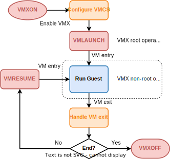

# 1. Intel VMX简介和初始化

在本阶段，我们将对虚拟化中的基本概念，以及 Intel VMX 指令扩展进行简单介绍。在代码部分，将介绍 VMX 模式的使能与关闭。

> 架构手册：[Intel 64 and IA-32 Architectures Software Developer’s Manual (SDM) Vol. 3C](https://cdrdv2.intel.com/v1/dl/getContent/671447), Chapter 24

## 1.1 虚拟化基本概念

* **Host 模式**：能直接访问硬件，有最高的特权级的模式。Hypervisor 运行在此模式。
* **Guest 模式**：特权级低于 Host 模式，对硬件和内存的访问受 Host 模式下的 Hypervisor 控制。但在 Guest 所能访问的范围内能执行 OS 级别的特权指令，运行 Guest OS 等需要 OS 级特权操作的软件。
* **Hypervisor**：也叫 Virtual-Machine Monitors(VMM)，运行在 Host 模式下，拥有硬件资源的完全控制权限，并管理其上运行的 Guest 软件。
* **Guest 软件**：运行在 Guest 模式的软件（一般是一个操作系统，即 Guest OS），比 Hypervisor 特权级低，执行特定指令时会被 Hypervisor 拦截（intercept），在受控情况下访问硬件资源。
* **VM entry**：从 Host 模式切换到 Guest 模式，开始执行 Guest 软件的代码。
* **VM exit**：从 Guest 模式切换回 Host 模式，开始执行 Hypervisor 的代码。通常发生在执行特定指令、发生中断、非法操作等情况下。
* **VCPU**：由 Hypervisor 虚拟出来的，运行 Guest 软件的虚拟 CPU 及其私有状态。对于 Guest 软件来说类似于物理 CPU，对于 Hypervisor 来说类似于传统 OS 中的线程。一个 Guest OS 可具有多个 vCpu，vCpu 数量也可以多于物理 CPU 数量。
* **Guest VM**：即我们通常说的虚拟机，除了包含一个或多个 vCpu 外，还包含其他全局的系统状态和资源，如 Guest 物理内存、虚拟设备等。对于 Guest 来说类似于一台真实的计算机，对 Hypervisor 来说类似于传统 OS 中的进程，Hypervisor 可创建多个 Guest VM，各运行一个 Guest OS。

## 1.2 Intel Virtual-Machine eXtensions (VMX)

Intel VMX (也叫 Intel VT-x)，是 Intel 处理器提供的硬件虚拟化的技术。虽然同为 x86 架构，但 AMD 与 Intel 的硬件虚拟化技术不同，AMD 的被称为 SVM 或 AMD-V；我们目前只支持了 VMX。

在处理器使能VMX后，将具有两种运行模式 (统称VMX operation)：

1. **VMX root operation**：即 Host 模式，运行 Hypervisor。
2. **VMX non-root operation**：即 Guest 模式，运行 Guest 软件。

需要指出的是，VMX operation 和 x86 特权级并没有直接的关系，两者描述的是不同方向上的权限问题。VMX operation 和 x86 特权级可以组合，如 VMX non-root ring-0 表示 Guest 内核态，运行 Guest OS；Guest 用户程序运行在 VMX non-root ring-3；Hypervisor 通常运行在 VMX root ring-0。

为了配置 VMX non-root operation 的进入、运行、退出，以及保存 Guest 和 Host 的状态，VMX 中还有一个重要数据结构 Virtual-Machine Control Structure（**VMCS**），我们将在下一节中详细介绍。

此外VMX还提供了一些额外的指令，主要有：

| 指令 | 描述 |
|-----|------|
| `VMXON`       | 使能 VMX，进入 VMX (root) operation |
| `VMXOFF`      | 退出 VMX operation |
| `VMCLEAR`     | 清除指定 VMCS，使得其可以被激活 |
| `VMPTRLD`     | 在当前 CPU 上激活指定 VMCS，使其成为当前 VMCS |
| `VMREAD`      | 读当前 VMCS 字段 |
| `VMWRITE`     | 写当前 VMCS 字段 |
| `VMLAUNCH`    | 进入 VMX non-root operation (当前 VMCS 首次进入) |
| `VMRESUME`    | 进入 VMX non-root operation (当前 VMCS 非首次进入) |
| `VMCALL`      | 在 VMX non-root operation 执行，触发 VM exit，从而调用 hypervisor 的功能 (类似 syscall) |

## 1.3 Hypervisor 工作流程

基于 Intel VMX 实现的 Hypervisor，其基本工作流程如下（相关代码在`crates/hypercraft/src/arch/x86_64/vmx/`）：

1. Hypervisor 执行 `VMXON` 指令，使能 VMX，进入 VMX root operation。
2. Hypervisor 配置 VMCS。
3. Hypervisor 执行 `VMLAUNCH`/`VMRESUME` 指令，发生 VM entry，切换到 VMX non-root operation，执行 guest 代码。
4. Guest 软件在发生特定事件后，会导致 VM exit，自动切换回 VMX root operation，hypervisor 需要根据 VM exit 的原因采取进一步操作。
5. Guest 执行完毕，hypervisor 执行 `VMOFF` 指令，退出 VMX 模式。



## 1.4 使能 VMX

本节我们介绍如何使能 VMX 模式。

### 1.4.1 检查 VMX 支持情况

首先，我们需要检查当前硬件平台是否支持 VMX 指令扩展，这一步又可以细分为两种情况：

* CPU 不支持 VMX
* CPU 支持 VMX，但被 BIOS 禁用

对于 CPU 支持情况，是通过 [`CPUID` 指令](https://en.wikipedia.org/wiki/CPUID#EAX=1:_Processor_Info_and_Feature_Bits) 查询 Processor Info and Feature Bits (`EAX=1`) 中的相关位获知。

对于 BIOS 支持情况，需要查询 `IA32_FEATURE_CONTROL` MSR 的以下两位：

* Bit 0 lock bit：如果设置，无法修改该 MSR；如果不设置，无法执行 `VMXON`。
* Bit 2 enables VMXON outside SMX operation：如果不设置，无法 (在 SMX 模式外) 执行 `VMXON`。

我们希望这两个位都已被设为了 1，否则就要重新设置。不过在 bit 0 为 1，而 bit 2 为 0 时，我们既无法使用 `VMXON` 指令，又无法修改该 MSR。此时说明 VMX 被 BIOS 禁用，需要在 BIOS 中手动开启。

### 1.4.2 (可选) 检查相关系统寄存器

在使能 VMX 之前，一般还需要检查相关系统寄存器的某些位设置是否符合要求，并检查 VMX 的一些子功能是否被支持，这不影响 VMX 的使能成功，但便于在使能失败或后续操作失败时排查原因。感兴趣的可以参见代码与架构手册。

### 1.4.3 执行 VMXON

在执行 `VMXON` 指令前，需要先将 `CR4` 的 `VMXE` 位 (13 位) 设为 1。然后创建 **VMXON region**，这是一块 4KB 大小 4KB 对齐的特殊内存，其物理地址将作为操作数提供给 `VMXON` 指令。VMXON region 还需要满足特定的格式：前 4 字节的低 31 位需要设置为 **VMCS revision identifier**，该值可以在 `IA32_VMX_BASIC` MSR 的低 31 位中查到。

由于 `VMXON` 的作用范围只有当前 CPU，所以在多核系统中如果有多个 CPU 需要使能 VMX，则需要在相应 CPU 上各自执行一遍 `VMXON` 指令，并提供不同的 VMXON region。

如果已使能 VMX，并在 guest 运行结束后要关闭 VMX，应当先执行 `VMXOFF` 指令，再将 `CR4` 的 `VMXE` 位清除。

### 1.4.4 小结

最后，总结一下使能 VMX 的一般流程：

1. 执行 `CPUID` 指令，检查 CPU 支持情况。
2. 查询或设置 `IA32_FEATURE_CONTROL` MSR，检查 VMX 是否被 BIOS 禁用。
3. 查询 `IA32_VMX_BASIC` MSR，获取 VMCS revision identifier。
4. 创建 VMXON region，写入 VMCS revision identifier。
5. 设置 `CR4` 的 `VMXE` 位。
6. 传入 VMXON region 物理地址，执行 `VMXON` 指令。

## 1.5 实现

首先是检查 VMX 的支持情况，Rust 可使用 [raw_cpuid](https://docs.rs/raw-cpuid/latest/raw_cpuid/) 库来进行 `CPUID` 各功能的查询:

```Rust
pub fn has_hardware_support() -> bool {
    if let Some(feature) = CpuId::new().get_feature_info() {
        feature.has_vmx()
    } else {
        false
    }
}
```

`VmxPerCpuState`（及其外层封装`PerCpu`）是一个 per-CPU 结构，用于管理每个物理 CPU 私有的虚拟化相关状态 (如 VMXON region)，由 hypercraft 的调用者创建。由于目前只有单核实现，故`app/hv`直接在栈上创建了`PerCpu`。

```Rust
let mut p = PerCpu::<HyperCraftHalImpl>::new(hart_id);
p.hardware_enable().unwrap();
```

启用 VMX 的具体逻辑位于 `VmxPerCpuState::hardware_enable` 函数，其中依次执行了以下步骤：

* 确保当前硬件支持 VMX，且还未被使能。
* 检查与配置 `IA32_FEATURE_CONTROL` MSR。
* 检查 `CR0` 和 `CR4` 的位设置是否符合要求 (SDM Vol. 3C, Appendix A.7, A.8)。
* 从 `IA32_VMX_BASIC` MSR 读取 VMCS revision identifier，并检查其他位是否符合要求。
* 初始化 VMXON region。由于之后阶段配置 VMCS 时也需要分配一个类似的内存区域 (VMCS region)，且格式与 VMXON region 一样，因此代码中用一个 `VmxRegion` 结构体统一这两种用途。
* 设置 `CR4` 的 `VMXE` 位。
* 传入 VMXON region 物理地址，执行 `VMXON` 指令。

在`msr.rs`中，我们通过 `Msr` 结构体实现了对各种 MSR 寄存器 (Model-Specific Registers) 的读写。

## 1.6 练习

1. 阅读[Intel SDM Vol. 3C](https://cdrdv2.intel.com/v1/dl/getContent/671447), Chapter 24: Introduction to Virtual Machine Extensions（共4页）
2. 阅读代码，描述在使能 VMX 的过程中 `vmx_region` 是如何分配和初始化的。（使能 VMX 的过程在 `crates/hypercraft/src/arch/x86_64/vmx/percpu.rs` 中的 `VmxPerCpuState::<H>::hardware_enable` 函数）