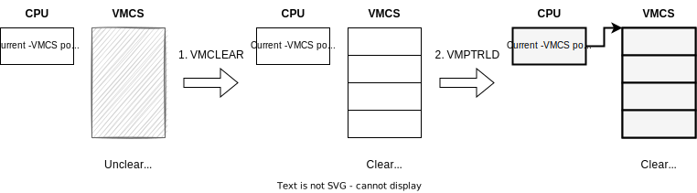

# 2. VMCS 配置

在本阶段，我们将介绍并配置 VMX 中的一个重要数据结构 VMCS。

> 架构手册：[Intel 64 and IA-32 Architectures Software Developer’s Manual (SDM) Vol. 3C](https://cdrdv2.intel.com/v1/dl/getContent/671447), Chapter 25

## 2.1 Virtual Machine Control Structures (VMCS) 介绍

在硬件中，一般只有一套完整的机器状态，而虚拟化要求在一个物理 CPU 上同时运行 Host 和 Guest，因此需要在 VM entry/VM exit 时切换 Host/Guest 的机器状态。这可以类比于在用户态和内核态切换时保存/恢复上下文的操作。而 Host/Guest 切换时需要保存的状态就被存储在一块专门的内存 VMCS 中。

VMCS 是一个存储在内存中的数据结构，和 vCPU 一一对应，每有一个 vCPU 都需要配置其相应的 VMCS。其中除了存储 Guest/Host 状态外，还有一些字段可以控制虚拟化的行为。VMCS 的内容具体包括以下几类：

1. **Guest-state area**：在 VM exit 时，Guest 的状态会自动被保存到该区域，并在 VM entry 时自动从该区域恢复。
2. **Host-state area**：在 VM exit 时，Host 的状态会从该区域恢复 (VM entry 时不会自动保存)。
3. **VM execution/entry/exit control fields**：对运行、进入、退出 Guest 模式时处理器的行为进行配置，如配置哪些情况下会发生 VM exit。
4. **VM exit information fields**：只读字段，报告 VM exit 发生时的一些信息，如发生 VM exit 的原因。我们将在下一节中用到此类字段。

VMCS 所在的内存被称为 **VMCS region**，与 VMXON region 一样，也是 4KB 大小 4KB 对齐的，且需要向前 4 字节写入 VMCS revision identifier。VMCS region 的物理地址被称为 **VMCS pointer**。

物理 CPU 在首次进入 non-root 模式之前，需要先激活 vCPU 对应的 VMCS，方法是依次执行以下两条指令 (VMCS pointer 作为操作数)：

1. `VMCLEAR`：将该 VMCS 设为“干净的”，使得其可以被激活。
2. `VMPTRLD`：将该 VMCS 激活，即将该 VMCS 与当前物理 CPU 绑定，该 VMCS 就被称为“当前 VMCS”，之后的 `VMREAD`/`VMWRITE`/`VMLAUNCH`/`VMRESUME` 指令只对当前 VMCS 生效。对应的还有 `VMPTRST` 指令，用于取得当前的 VMCS pointer (在本项目中不需要用到)。

访问 VMCS 中的字段不能直接使用内存读写指令，而是要用专门的 `VMREAD`/`VMWRITE` 指令。

## 2.2 VMCS Host 状态

VMCS Host 状态会在发生 VM exit 而从 non-root 切换回 root 时，从 VMCS 自动加载进处理器中，但在 VM entry 时不会自动保存。这些状态主要包括：

* 控制寄存器：`CR0`、`CR3`、`CR4`。
* 指令指针与栈指针：`RIP`、`RSP`。
* 段选择子 (selector)：`CS`、`SS`、`DS`、`ES`、`FS`、`GS`、`TR`。
* 段基址 (base address)：`FS base`、`GS base`、`TR base`、`GDTR base`、`IDTR base`。
* 一些 MSR，如 `IA32_PAT`、`IA32_EFER`。

在配置时，一般直接将它们设为当前 (Host) 的状态即可。但是 `RIP` 应该设为 VM exit 处理函数的地址，`RSP` 应该设为处理 VM exit 时的栈指针。

## 2.3 VMCS Guest 状态

VMCS Guest 状态会在发生 VM entry 时从 VMCS 自动加载进处理器中，并在 VM exit 时自动保存到 VMCS 中。这些状态主要包括：

* 控制寄存器：`CR0`、`CR3`、`CR4`。
* `RIP`、`RSP`、`RFLAGS`。
* 完整的段寄存器：即 `CS`、`SS`、`DS`、`ES`、`FS`、`GS`、`TR` 段的选择子、基址、界限 (limit) 与访问权限 (access rights)。
* `GDTR` 与 `IDTR` 的基址与界限。
* 一些 MSR，如 `IA32_PAT`、`IA32_EFER`。

在设置时，还需要考虑 Guest 的运行模式。在 x86 下，运行模式包括 16 位实模式、32 位保护模式、64 位 IA-32e 模式，不同的运行模式需要配置好对应的段寄存器访问权限。其中 `CS` 段寄存器的访问权限还指示了 Guest 的当前特权级 (CPL)。

需要注意，VMCS 也不是包含了所有的机器状态，如 `RAX`、`RBX` 等通用寄存器就不在 VMCS 字段中，因此它们需要在 VM entry/exit 时由软件实现保存与恢复。

## 2.4 VMCS 控制字段

### 2.4.1 VM-Execution Control Fields

这些字段用于控制在 non-root 模式运行时处理器的行为。常用的有以下几个：

* Pin-based VM-execution controls：用于配置 hypervisor 对 Guest 异步事件的拦截 (例如中断)。
* Processor-based VM-execution controls：又可分为 primary processor-based 和 secondary processor-based，用于配置 hypervisor 对 Guest 同步事件的拦截 (例如执行特定的指令)。
* Exception bitmap：用于配置 hypervsior 对 Guest 异常的拦截。
* I/O-bitmap address：用于配置 hypervisor 对 Guest 读写特定 I/O 端口的拦截。
* MSR-bitmap address：用于配置 hypervisor 对 Guest 读写特定 MSR 的拦截。
* Extended-page-table pointer：指定扩展页表 (EPT) 的基址。(Step 4)

以上字段除了带 address、pointer 外的都是一个 bitmap，将相应的位设为 1 或 0 就表示启用或关闭了相应的功能。

需要注意，对 pin-based、primary processor-based、secondary processor-based VM-execution controls 以及下文的 VM-exit controls、VM-entry controls 的配置较为繁琐。因为同一个字段，不同的 CPU 对各个位的支持情况 (默认值和允许值) 不同，需要根据支持情况设置未用到的位的默认值。感兴趣的参见代码或 SDM Vol. 3D 附录 A.2 ~ A.5。

### 2.4.2 VM-Exit Control Fields

这些字段用于控制在 VM exit 发生时处理器的行为。除了 VM-exit controls 外，还有：

* VM-exit MSR-store count、VM-exit MSR-store address：VM exit 时要保存的 (Guest) MSR 数量与内存区域。
* VM-exit MSR-load count、VM-exit MSR-load address：VM exit 时要载入的 (Host) MSR 数量与内存区域。

因为除了 `IA32_EFER`、`IA32_PAT` 等少量 MSR 外，VMCS 中没有空间存储其他 MSR 了，因此在这里指定了一个要额外保存与恢复的 MSR 的列表。这样的设计也使得在 VM exit 时避免切换不常用的 MSR，从而减少 Guest 与 Host 间的切换开销。VM-entry control fields 中也有类似的字段。

### 2.4.3 VM-Entry Control Fields

这些字段用于控制在 VM entry 发生时处理器的行为。除了 VM-entry controls 外，还有：

* VM-entry MSR-load count、VM-entry MSR-load address：VM entry 时要载入的 (Guest) MSR 数量与内存区域。
* VM-entry interruption-information field：用于向 Guest 注入虚拟中断或异常。(以后会用到)

## 2.5 实现

VMCS 的实现在`crates/hypercraft/src/arch/x86_64/vmx/vmcs.rs`中，其中大量使用了宏等 Rust 编程技巧，阅读起来有一定难度。同时可以发现，读写 VMCS 的字段时不需要手动指定 VMCS region 的地址，这是因为 `VMCLEAR`、`VMPTRLD` 两条指令选定了“当前 VMCS”之后， `VMREAD`、`VMWRITE` 即可直接在“当前 VMCS”中读写了。

在 `VmxVcpu` 结构体（`crates/hypercraft/src/arch/x86_64/vmx/vcpu.rs`）内的 `setup_vmcs` 函数中，首先执行 `VMCLEAR` 和 `VMPTRLD` 指令激活 VMCS，然后又分 Host、Guest、Control 三部分进行分别配置。

在 `setup_vmcs_host` 中，大多数 Host 状态通过直接读取当前对应的系统状态进行配置，除了 `RSP` 和 `RIP`：`RIP` 设置为 `vmx_exit` 函数的地址，`RSP` 则是在 VM-entry 时进行设置。

在 `setup_vmcs_guest` 中，我们先配置 Guest 的 `CR0` 禁用保护模式与分页，并只设置 `CR4` 的 `VMXE` 位。同时还配置了 `CR0`/`CR4` 的 Guest/Host masks 和 read shadows，这些字段会影响对 Guest 读写 `CR0`/`CR4` 的拦截 (详见 SDM Vol. 3C, Section 24.6.6)。之后，我们使用一个宏 `set_guest_segment!` 来配置 Guest 的段寄存器，其中基址与选择子全为 0，界限全为 `0xffff`，访问权限为 16 位。其他系统状态也都设为了默认值。

在 `setp_vmcs_control` 中，我们通过 `vmcs::set_control` 函数，可设置或清除指定控制字段的某些位，包括：

* 在 pin-based controls 设置了 NMI 中断拦截，外部中断拦截。
* 在 primary processor-based controls 取消了 `CR3` 读写拦截。
* 在 secondary processor-base controls 中设置了 Guest 能使用 `RDTSCP` 和 `INVPCID` 指令。
* 在 exit controls 中设置了退出时为 64 位 Host、自动切换 Host/Guest 的 `IA32_PAT` 与 `IA32_EFER`。
* 在 entry controls 中设置了进入时自动载入 Guest `IA32_PAT` 与 `IA32_EFER`。

此外，我们将不会在 entry/exit 时保存与恢复其他 MSR，因为 hypervisor 没有用到其他 MSR，且目前只有一个 vCPU 而不需要切换。

对于 exception 和 I/O bitmap 设为空，表示直通所有 Guest 异常与 I/O 指令；而 MSR bitmaps 为空表示拦截所有 MSR 读写。

# 2.6 练习

1. 阅读 Intel SDM Vol. 3C, Chapter 25: Virtual-Machine Control Structures 相关小节，回答以下问题：
    1. 如果让要 hypervisor 实现以下功能，应该如何配置 VMCS？
        1. 拦截 Guest `HLT` 指令
        2. 拦截 Guest `PAUSE` 指令
        3. 拦截外部设备产生的中断，而不是直通给 Guest
        4. 打开或关闭 Guest 的中断
        5. 拦截 Guest 缺页异常 (#PF)
        6. 拦截所有 Guest I/O 指令 (x86 `IN`/`OUT`/`INS`/`OUTS` 等)
        7. *只拦截 Guest 对串口的 I/O 读写 (I/O 端口为 `0x3f8`)
        8. 拦截所有 Guest MSR 读写
        9. *只拦截 Guest 对 `IA32_EFER` MSR 的写入
        10. *只拦截 Guest 对 `CR0` 控制寄存器 `PG` 位 (31 位) 的写入
    2. *如果要在单核 hypervisor 中交替运行两个 vCPU，应该如何操作 VMCS？
