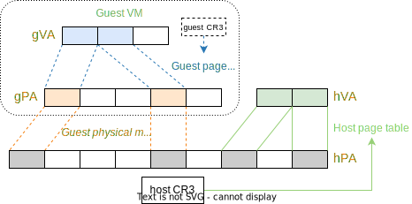
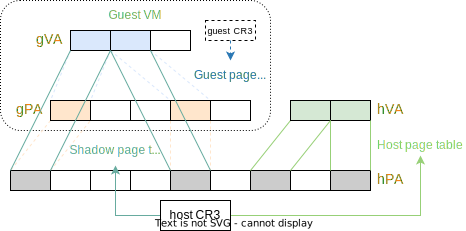
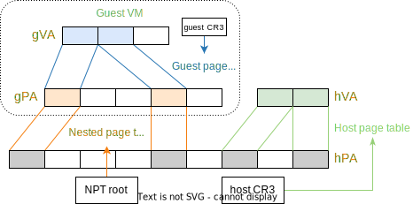
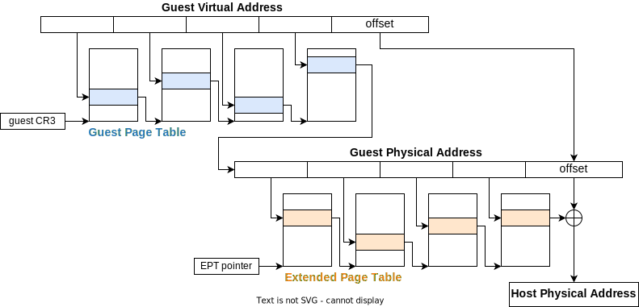
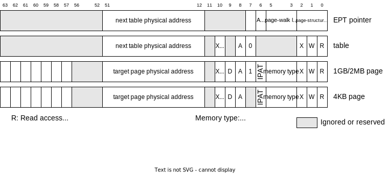

# 4. EPT 与内存隔离

在本阶段，我们将了解 EPT 与内存虚拟化，实现 Guest 与 Hypervisor 的内存隔离。

> 架构手册：[Intel 64 and IA-32 Architectures Software Developer’s Manual (SDM) Vol. 3C](https://cdrdv2.intel.com/v1/dl/getContent/671447), Chapter 29

## 4.1 内存虚拟化概述

在启用分页机制的处理器中，软件使用的是虚拟地址，经过页表的转换，转换为物理地址后，才能访问物理内存。在虚拟化中，我们需要虚拟化 Guest VM 的物理内存。此时 Guest 上的软件使用的就是 **Guest 虚拟地址 (gVA)**，通过 Guest 页表转换为 **Guest 物理地址 (gPA)**。而为了安全和功能的考虑， Hypervisor 不能让 Guest 直接用 Guest 物理地址去访问物理内存，需要再经过一次转换，转换为 **Host 物理地址 (hPA)** 才能访问。通过这个过程，Hypervisor 就实现了内存的虚拟化，`gVA`、`gPA`、`hPA`就是内存虚拟化所涉及的三种地址。

实现内存虚拟化有两种方式：无需硬件支持的影子分页，和需要硬件支持的嵌套分页。

### 4.1.1 影子分页 (shadow paging)

对于影子分页，无需专门的硬件，即无嵌套分页支持的硬件。早期的 VMX 虽然是硬件虚拟化，但还未实现 EPT，就需要通过影子分页实现内存虚拟化。影子分页只使用了普通页表就能实现 Guest 物理内存的虚拟化。

对于 Guest OS 来说，一般情况下意识不到 Hypervisor 的存在，因此会像在真实机器上那样，配置好 Guest 页表，负责把 gVA 转换为 gPA。而在 Hypervisor 中也会维护一个 Guest 物理内存映射，负责把 gPA 转换为 hPA，但不一定要是页表这样的分级结构，因为硬件不会直接使用。

**影子页表 (shadow page table)** 就是通过合并 Guest 页表与 Hypervisor 中的 Guest 物理内存映射，直接得到 gVA 到 hPA 的映射，然后根据这一映射构造出的普通页表。运行 Guest 时，只需将 Host 页表基址 (`CR3`) 设为影子页表，当 Guest 使用 gVA 进行访问时，就经过影子页表的转换，直接得到 hPA，从而正确进行内存访问。

当 Guest 修改 Guest 页表时，Hypervisor 需要进行拦截，并修改对应的影子页表，这可以通过在影子页表中去掉 Guest 自身页表的映射来实现。当 Guest 切换 Guest 的 `CR3` 以切换地址空间时，Hypervisor 也需要进行拦截，并切换对应的影子页表。

### 4.1.2 嵌套分页 (nested paging)

嵌套分页又称二维分页 (2-dimensional paging)、二级地址转换 (Second Level Address Translation)，是由硬件提供了一个类似普通页表的结构，把 gPA 转换为 hPA，即**嵌套页表 (nested page table)**。

Intel VMX 中的嵌套页表称作 **EPT (Extended Page Table)**，而 AMD SVM 中的称作 NPT (Nested Page Table)，ARM 中的称作 Stage-2 Page Table。

嵌套页表的基址 (NPT root)，以及 Guest 页表基址在硬件中都有对应的寄存器。嵌套页表和 Host 页表是独立的，互不影响。当 Guest 使用 gVA 进行访问时，硬件会先通过 Guest 页表转换为 gPA，再通过嵌套页表转换为 hPA，才能进行内存访问，因此会比用影子分页多一次页表结构的遍历。当 Guest 应用 TLB 缺失比较严重时，最坏情况下会触发多达 20 多次内存访问，带来严重的性能下降。在实际应用中我们可以通过在嵌套页表中使用大页来减少这种开销。

### 4.1.3 对比

|| 影子分页 | 嵌套分页 |
|-|-|-|
| 特殊硬件      | ✘ | ✓ |
| 实现方式      | 复杂 | 简单 |
| TLB 缺失开销  | 小 | 大 |
| 映射修改开销  | 大 | 小 |
| 页表切换开销  | 大 | 小 |
| 内存空间占用  | 大 | 小 |

## 4.2 Intel EPT 介绍

本项目会使用 Intel EPT 提供的嵌套分页机制，实现内存虚拟化。

### 4.2.1 EPT 结构

EPT 与普通页表结构相似，一般都是 4 级，而且都可以设置大页来直接映射一块 1GB 或 2MB 大小的页面。Guest 页表基址保存在 VMCS **Guest CR3** 字段中，EPT 基址保存在 **extended-page-table pointer (EPTP)** 字段中。

下图展示了一个 Guest 虚拟地址，通过 Guest 页表转换为 Guest 物理地址，再通过 EPT 转换为 Host 物理地址的过程。

### 4.2.2 EPT 页表项

与普通页表一样，EPT 页表的每个表项都有一些标志位，表示访问权限等信息。

下图分别给出了 EPT pointer 和几种页表项的格式，包括指向下一级页表的 table 表项、指向 1GB/2MB 大页的表项、以及指向 4KB 页面的表项：

其中低 3 位 RWX 分别为读写执行权限位；第 7 位表示该页表项指向大页还是中间级页表；3 至 5 位为内存类型，对于普通内存就是 6，启用 write-back cache，对于 MMIO 这样的设备内存就是 0 不启用 cache；从第 12 位开始都是一个 (Host) 物理地址，表示下一级页表物理地址，或是目标的页表的物理地址。

### 4.2.3 EPT Violation

当硬件使用 EPT 转换一个 gPA 时，如果中途发生了页面不存在，或是权限不匹配等错误时，会触发一个 VM exit，名为 **EPT violation**，类似普通页表中的缺页异常 (page fault)。

一般情况下，发生 EPT violation，就是 Guest 非法访问了一个 Guest 物理地址，应该杀掉整个 Guest 或报错。但我们也可以利用 EPT violation 实现一些功能。如实现页面交换、按需分配 Guest 物理内存、虚拟化对设备的 MMIO 访问等。

VMCS 中有提供了一些与 EPT violation 有关的信息，比如 **Exit qualification** 会保存访问者的权限信息，用 bit 0/1/2 分别表示是一个 读/写/执行 访问导致了这个 EPT violation (类似缺页异常时的 error code)。此外 **Guest-physical address** 表示出错的 Guest 物理地址，**Guest-linear address** 表示出错的 Guest 虚拟地址等。

### 4.2.4 小结

最后，我们给出一个普通页表和 EPT 的对比：

|| Page Table | Extended Page Table |
|-|-|-|
| 地址转换  | VA → PA | gPA → hPA |
| 基址 | CR3 | VMCS EPT pointer |
| 转换失败 | 缺页异常 (#PF) | VM Exit: EPT violation |
| Invalidate TLB | `MOV` to CR3 | `INVEPT` |

## 4.3 实现

### 4.3.1 处理 EPT Violation

由于我们暂时不支持动态 Guest 内存分配或 MMIO 设备虚拟化，故目前不对 **EPT violation** 做任何特殊处理，直接 `panic`。

### 4.3.2 VMCS 配置

`crates/hypercraft/src/arch/x86_64/vmx/vmcs.rs` 中提供了以下和 EPT 直接相关的功能：

1. 设置EPT的函数 `set_ept_pointer`；
2. 通过 `INVEPT` 指令无效 TLB 的函数 `invept`；

### 4.3.4 页表相关结构

`crates/page_table_entry/src/arch/x86_64/epte.rs` 中定义了 EPT 的页表项 `EPTEntry`。

`crates/page_table/src/bits64.rs` 中实现了一个通用的四级页表结构 `PageTable64`。

组合以上两者，即可得到一个 EPT `pub type ExtendedPageTable<I> PageTable64<ExtendedPageTableMetadata, EPTEntry, I>;`。

# 4.4 练习

1. 假设一个 Hypervisor 中运行有 4 个 Guest VM，每个 Guest VM 中运行有 10 个应用 (需要 10 个 Guest 页表)，请问在用影子分页方式实现内存虚拟化时，Hypervisor 共需维护多少份影子页表？
2. 假设在 Guest OS 中启用了 4 级页表，Guest 的一次访存 (使用 Guest 虚拟地址) 会导致多少次内存访问？（使用 4 级嵌套页表实现内存虚拟化；假设 TLB 全部失效；假设不出现缺页或 EPT Violation）
3. 简述：如果要改成按需分配内存，应该在代码上作出哪些修改？
