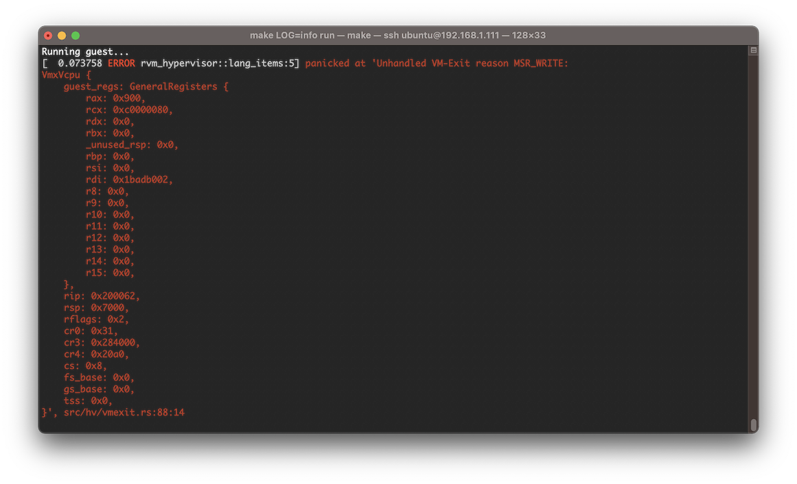
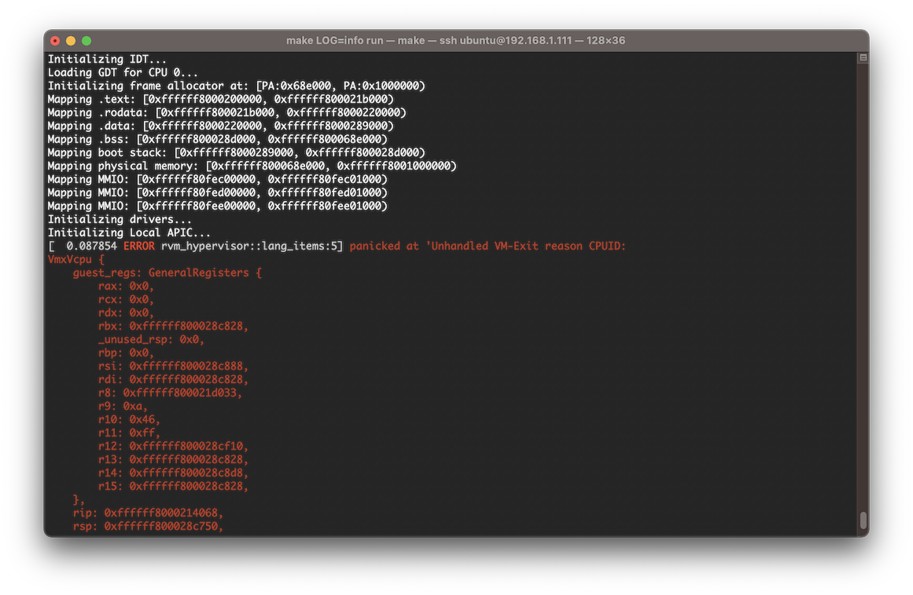

# 5. 运行一个相对完整的Guest OS

在本阶段，我们将运行一个相对完整的 Guest OS。

## 5.1 Guest OS 与 Guest BIOS 介绍

### 5.1.1 Guest NimbOS

我们准备的 Guest OS 为 [NimbOS](https://github.com/equation314/nimbos)。该 OS 也是用 Rust 语言编写的实验操作系统，代码量在 5K 行左右，而与 x86 硬件相关部分的代码小于 1K 行。此外，它还实现了抢占式调度、多线程用户程序、基本系统调用的支持等 OS 功能。在设备方面，实现了 x86 的串口、HPET 高精度时钟、Local APIC 和 I/O APIC 中断控制器等。因此，NimbOS 既简单，又具有一个操作系统的最基本功能，非常适合作为我们的 Guest OS，运行到我们的 hyperviosr 上。

为了能在我们的 Hypervisor 上运行，我们只需关注 NimbOS 与硬件相关部分的代码即可，比如启动过程、x86 特殊指令、设备访问等。我们首先来了解 NimbOS 的启动过程，这部分的代码位于 [nimbos/kernel/src/platform/pc/multiboot.S](https://github.com/equation314/nimbos/blob/545ab808b462cf606bd5073c6dad9b86297b761c/kernel/src/platform/pc/multiboot.S)。

NimbOS 是通过 [multiboot 协议](https://www.gnu.org/software/grub/manual/multiboot/multiboot.html#Machine-state) 启动的。因此启动过程分为两部分，首先是 BIOS 或 bootloader 启动，将系统设置为协议规定的状态，再开始运行 NimbOS 的启动代码，完成剩余部分的启动。例如，在 x86 处理器上，OS 一般是从 16 位实模式开启启动的，但对于 multiboot 协议，就规定了刚进入 OS 时已经是 32 位保护模式。因此就需要 BIOS 或 bootloader 完成 16 位到 32 位的切换，然后 OS 直接从 32 位开始启动。下面列出了按照 multiboot 协议，在进入 OS 前，要求 BIOS 或 bootloader 设置好的系统状态：

* `CR0.PE = 1` (保护模式)
* GDT 有效
* `CS`、`DS`、`ES`、`FS`、`GS`、`SS` 这些段寄存器有效
* `EAX` = `0x2BADB002` (magic number)
* `EBX` = Multiboot information address (目前不支持)
* `ESP` 有效
* 关中断

因此，在我们的 Hypervisor 中，为了遵循 multiboot 启动协议，有两种启动方式：

1. Hyperviosr 为 Guest OS 建立好所需的状态，直接进入 32 位 Guest。但是这样就需要配置 Guest GDT 和段寄存器；
2. 通过一段类似 BIOS 的代码，Hypervisor 先进入 16 位 Guest BIOS，之后 Guest GDT 的配置，16 位到 32 位的切换，Guest OS 启动状态的设置，都由 BIOS 来完成。

本项目实现的是方法二。该方法将复杂的状态设置都交给 Guest BIOS 来处理，而对 Hypervisor 的配置相对较少。

### 5.1.2 Guest BIOS

本节将介绍 Guest BIOS。虽然名字叫 BIOS，但为了简单，我们并没有实现一个 BIOS 应该具有的功能，如初始化设备、配置中断向量表 (为 OS 提供一些服务) 等，所以只能称得上是一个 bootloader，只用于 Guest OS 的启动。

BIOS 完成了以下工作：

1. 配置初始 GDT，这是进入 32 所必须的
2. 从 16 位实模式切换到 32 位保护模式
3. 根据 multiboot 协议，初始化其他系统状态
4. 跳转到 32 位 Guest OS 的入口地址 (gPA)，这里我们硬编码为 `0x20_0000`

Guest BIOS 的核心代码如下：

```asm
.code16
entry16:
    cli
    cld
    xor     ax, ax
    mov     ds, ax
    mov     es, ax
    mov     ss, ax

    lgdt    [prot_gdt_desc] ; initial GDT
    mov     eax, cr0
    or      eax, 0x1        ; CR0.PE = 1
    mov     cr0, eax

    ljmp    0x8, entry32    ; long jump, CS = 0x8, EIP = entry32

.code32
entry32:
    mov ax, 0x10            ; set all data segment selectors to 0x10
    mov ds, ax
    mov es, ax
    mov ss, ax
    mov fs, ax
    mov gs, ax

    mov esp, 0x7000         ; temporary stack
    mov ecx, 0x200000       ; kernel entry
    mov eax, 0x2BADB002     ; multiboot magic
    mov ebx, 0              ; multiboot information (unsupported)
    jmp ecx

.balign 16
prot_gdt:
    .quad 0x0000000000000000    ; 0x00: null
    .quad 0x00cf9b000000ffff    ; 0x08: code segment (base=0, limit=0xfffff, type=32bit code exec/read, DPL=0, 4k)
    .quad 0x00cf93000000ffff    ; 0x18: data segment (base=0, limit=0xfffff, type=32bit data read/write, DPL=0, 4k)

prot_gdt_desc:
    .short  prot_gdt_desc - prot_gdt - 1    ; limit
    .long   prot_gdt                        ; base
```

### 5.1.3 Guest 物理内存布局

下面给出了在本阶段中，Guest 的物理内存布局。

在 Hypervisor 地址空间的两处高地址 `0x400_0000` 和 `0x400_1000`，分别是一块保留内存，用于存放 Guest BIOS 与 Guest OS 镜像。这两个地址在 QEMU 启动参数中指定。

Guest 的物理内存布局（即 Hypervisor 所分配的 `GUEST_PHYS_MEMORY` 那块内存）如下。入口地址 `0x8000` 处放置Guest BIOS，地址 `0x20_0000`处放置Guest OS。在启动前，Guest BIOS 与 Guest OS 的镜像会先从 `0x400_0000` 拷贝到 `GUEST_PHYS_MEMORY` 中的相应位置。

除了 `0 ~ 0x100_0000` 这 16MB 的物理内存，Guest NimbOS 还会通过 MMIO 访问设备。目前 Guest 对设备的访问都是直通，因此 MMIO 内存段在嵌套页表中都使用对等映射，即 gPA 等于 hPA。此外，由于 MMIO 内存段都是设备内存，需要在 EPT 中配置为不使用 cache。Guest 所用的几个 MMIO 内存段如下表所示：

| 名称 | 起始 gPA | 大小 | MemFlags | EPT 映射 |
|-|-|-|-|-|
| RAM        | `0x0` | `0x100_0000` | RWX | `GUEST_PHYS_MEMORY` |
| IO APIC    | `0xFEC0_0000` | `0x1000` | RW, Dev | 对等 |
| HPET       | `0xFED0_0000` | `0x1000` | RW, Dev | 对等 |
| Local APIC | `0xFEE0_0000` | `0x1000` | RW, Dev | 对等 |

## 5.2 处理更多 VM Exit

### 5.2.1 MSR 读写

当完成以上设置后，如果直接运行 Guest NimbOS，会出现以下错误：



根据提示，出错原因是发生了一个名为 “MSR write” 的 VM exit，但我们未处理。出错的 Guest RIP 为 `0x200062`，反汇编 Guest NimbOS 代码可得：

```asm
200053: b9 80 00 00 c0             mov     ecx, 0xc0000080
200058: ba 00 00 00 00             mov     edx, 0x0
20005d: b8 00 09 00 00             mov     eax, 0x900
200062: 0f 30                      wrmsr
```

即 Guest 执行了一条 `WRMSR` 指令，向 IA32_EFER MSR (`0xC000_0080`) 写入 `0x900`，导致发生 VM exit。为了解决这一问题，我们的处理方法很简单：直通所有 MSR 的访问。下面就来分析直通所有 MSR 访问是否会有问题。

下表列出了 Guest NimbOS 会用到的所有 MSR：

|  MSR | 用途 |
|-|-|
| `IA32_EFER` | 切换到 64 位，启用 syscall |
| `IA32_STAR` | syscall 支持 |
| `IA32_LSTAR` | syscall 支持 |
| `IA32_FMASK` | syscall 支持 |
| `IA32_GS_BASE` | per-CPU 数据支持 |
| `IA32_KERNEL_GSBASE` | per-CPU 数据支持 |
| x2APIC 相关 MSR | Local APIC 访问 |

对于 `IA32_EFER` 与 `IA32_PAT`，我们在 VMCS 中配置了对它们的切换，因此直通这两个 MSR 不会有问题。

对于 syscall 和 per-CPU 数据相关的 MSR，由于 Hypervisor 没有用到这些功能，且我们只有一个 Guest，所以将这些 MSR 完全分配给这唯一的 Guest 使用，也不会有问题，因此也可以直通。

剩下的 MSR 与 Local APIC 访问相关。会在下一章进行处理。

综上所述，目前我们可以安全地直通 Guest NimbOS 的所有 MSR 访问。

对于 MSR 的直通，需要在 VMCS 中配置 “**MSR-bitmap address**”。这是一个 4K 大小的页面，其中又分为 4 个子 bitmap，每个占用 1K，分别用于：

* Read bitmap for low MSRs (`0x0 ~ 0x1FFF`)
* Read bitmap for high MSRs (`0xC000_0000 ~ 0xC000_1FFF`)
* Write bitmap for low MSRs (`0x0 ~ 0x1FFF`)
* Write bitmap for high MSRs (`0xC000_0000 ~ 0xC000_1FFF`)

将 bitmap 中的相应位设为 1，就表示拦截这个 MSR 的访问，否则就直通。因此，如果要直通所有 MSR 的读写访问，就将该 4KB 页面全部清零。

### 5.2.2 CPUID 指令

处理 MSR 访问问题后，再次运行，会发生以下错误：



此次错误的原因是 Guest 在 `0xffffff8000214068` 处执行了 `CPUID` 指令：

```asm
ffffff800021405e: 48 89 fb             	mov	rbx, rdi
ffffff8000214061: 31 c0                	xor	eax, eax
ffffff8000214063: 31 c9                	xor	ecx, ecx
ffffff8000214065: 49 89 dd             	mov	r13, rbx
ffffff8000214068: 0f a2                	cpuid
```

`CPUID` 指令用于获取当前处理器所支持的硬件特性等信息。在虚拟化下，Guest OS 通过该指令查询处理器硬件特性，Hypervisor 应该返回 vCPU 的虚拟硬件特性，而不是 Host CPU 的，所以不能直接运行，会强制进行拦截。

在执行 `CPUID` 指令前，需要先设置 `EAX`，我们把它叫做 leaf，即查询哪一类信息。有时候还可设置 `ECX`，被称为 sub-leaf。执行完该指令后，硬件会自动设置 `EAX`，`EBX`，`ECX`，`EDX` 这 4 个寄存器，表示返回结果。所以我们的 Hypervisor 就需要模拟硬件的这一操作，设置 Guest 的这些寄存器。

我们使用以下方法实现对 `CPUID` 指令的模拟：先在 Host CPU 上执行 `CPUID` 指令，得到 Host CPU 的硬件信息，然后进行少量修改并返回。由于 Guest NimbOS 没有太多地依赖 `CPUID` 指令，所以即使不做特殊处理也不会对 Guest 的正常运行造成影响。不过这里我们为了演示 `CPUID` 指令的模拟，对以下这些情况做特殊处理：

* `EAX = 1` (Processor Info and Feature Bits)：清除 VMX 位 (`ECX` bit 5)，开启 Hypervisor 位 (`ECX` bit 31)
* `EAX = 0x4000_0000` (Hypervisor Information)：返回 Hypervisor 厂商信息字符串 (“`RVMRVMRVMRVM`”)
* `EAX = 0x4000_0001` (Hypervisor Feature Bits)：全返回 0

## 5.4 练习
1. 结合之前学习到的知识，解释 Guest BIOS 核心代码中 `prot_gdt` 和 `prot_gdt_desc` 都是什么内容。
2. 修改代码，使分配给 Guest OS 的内存容量从 16 MB 增加到 32 MB。
3. 简述：如果要使 NimbOS OS 被加载的地址从`0x20_0000`更改到其他地址，需要做哪些修改？