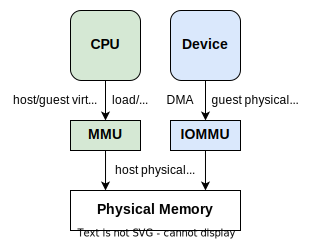
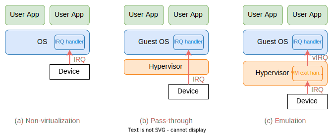
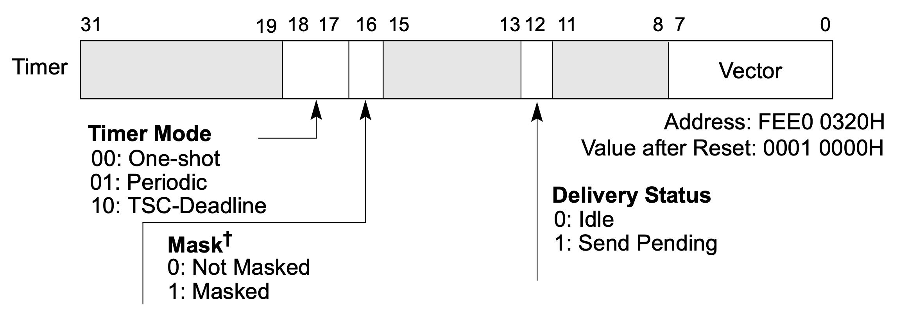

# 6. I/O 和中断虚拟化

在本阶段，我们将介绍对串口和 Local APIC 时钟设备的模拟，作为 I/O 与中断虚拟化的一个简单示例。

> 架构手册：[Intel 64 and IA-32 Architectures Software Developer’s Manual, Vol. 3A](https://cdrdv2.intel.com/v1/dl/getContent/671447), Chapter 11

## 6.1 概述：设备虚拟化

对于虚拟化来说，除了最基本的 CPU 与内存外，还包括重要的一部分，那就是外部设备 (device)。外部设备虽然种类繁多，如时钟、串口、网卡、键盘、磁盘控制器等等，但 CPU 与它们的基本交互方式都是一样的，无非就是两种：CPU 通过 I/O 操作调用设备的功能，或是反过来，设备通过中断来调用 CPU 的功能。因此，设备的虚拟化即 **I/O** 与**中断**的虚拟化。

根据虚拟化下 Guest 对设备访问方式的不同，可以分为以下三种实现：

1. **直通 (pass-through)**：即把一个物理设备完全分配给一个 Guest，其他 Guest 或是 Hypervisor 都无法再使用该设备。这种方法具有最佳的性能，实现起来也非常简单，但是不支持多路复用，即一个设备只能给一个 Guest 使用。到上一阶段为止，我们的 Guest NimbOS 对设备的访问都是采用直通的方式。
2. **模拟 (emulation)**：Hypervisor 拦截 Guest 的 I/O 操作或是发送给 Guest 的中断，并根据这些操作模拟设备的功能。这种方法通过 Hypervisor 的介入来支持多个 Guest 使用同一设备，还能虚拟出物理上不存在的设备。不过缺点是软件模拟的方式实现复杂、开销大。
3. **半虚拟化 (para-virtualization)**：是对设备模拟的一种优化，通过让 Guest 与 Host 按照人为规定的接口进行通信，而不需符合真实物理设备的规范。这种方法可以省去一些真实设备规范中的繁琐操作，从而大大提高设备访问速度，并简化设备驱动的实现。比如 [virtio](http://docs.oasis-open.org/virtio/virtio/v1.0/virtio-v1.0.html) 就提供了一套虚拟设备的规范，以此实现的设备驱动在性能与复杂性上都要远远优于按真实设备规范进行的实现。不过这种方式需要在 Guest 中实现专门的设备驱动，以此实现的 Guest OS 无法在真实物理机器上运行。

| | 直通 | 模拟 | 半虚拟化 |
|-|-|-|-|
| 实现方式 | 简单 | 复杂 | 复杂 |
| 性能开销 | 小 | 大 | 较小 |
| 多路复用 | 不支持 | 支持 | 支持 |
| Guest OS | 无修改 | 无修改 | 需要修改 |

## 6.2 I/O 虚拟化

首先我们来介绍几种基本的 I/O 方式，然后分别介绍它们的虚拟化方法：

1. **端口映射 I/O** (port-mapped I/O, PMIO)：一个设备被分到一个或多个专用的端口，处理器通过专门的 I/O 指令，对这些端口进行读写，来访问设备。如 x86 使用 `IN`/`OUT` 指令读写 I/O 端口。
2. **内存映射 I/O** (memory-mapped I/O, MMIO)：一段特殊的内存区域会被映射到设备上，处理器使用普通的内存读写指令，对该内存区域进行读写即可访问设备。这种方式在嵌入式系统中很常见。
3. **直接内存访问** (DMA)：让设备直接读写物理内存，而无需处理器的介入，从而实现高速访问。

### 6.2.1 PMIO

在 x86 中，可使用以下指令进行端口映射 I/O 访问：

* `IN`/`OUT`：向一个 I/O 端口，一次输入或输出一个字节/字/双字。
* `INS` (`INSB`,`INSW`, `INSD`) / `OUTS` (`OUTSB`, `OUTSW`, `OUTSD`)：字符串 I/O 指令，一般与 `REP` 前缀结合，可以一次输入或输出多个字节、字或是双字，具体数量可在 `ECX` 寄存器中指定。

为了模拟使用 PMIO 设备的行为，需要拦截先 Guest 的这些 I/O 指令。我们可以对 VMCS 进行如下配置：

1. 设置 VMCS primary processor-based VM-execution controls 的 **Unconditional I/O exiting** 位 (bit 24)，可拦截所有的 I/O 指令。
2. 或是在 VMCS 中配置 **I/O bitmap**，那么只有当 I/O 指令访问的端口在 bitmap 中被设置了，才会被拦截。

当我们设置好拦截后，如果 Guest 执行了相应的 I/O 指令，就会发生一个名为 “I/O instruction” 的 VM exit。此时可查询 VMCS 中的 **Exit qualification** 字段，获取有关该 I/O 指令的详细信息，便于之后对该 I/O 操作的模拟，包括：(Intel SDM Vol. 3C, Section 27.2.1, Table 27-5)

* 访问的端口
* 访问的大小 (字节、单字、双字)
* 访问的方向 (`IN` 或 `OUT`)
* 是否是字符串指令 (带后缀 `S`)

### 6.2.2 MMIO

MMIO 的访问与普通内存访问无异，主要看访问的物理地址是否在设备内存范围内。如下面这条指令：

```asm
88 07    mov byte ptr [rdi], al
```

对于 MMIO 指令的拦截，需要与内存虚拟化相配合。在内存虚拟化中，Guest 的地址会经过影子页表或是嵌套页表的转换，映射为 Host 物理地址。我们只需在影子页表或是嵌套页表中，取消 MMIO 内存段的映射，即可使 Guest 在进行访问时发生 VM exit，从而进行拦截。例如在 EPT 中取消 MMIO 内存段对应的 gPA 的映射，就能让 Guest 的访问触发 EPT violation。

在拦截 MMIO 指令后，我们还需获取此访问的相关信息。对于访问的 gPA、是读是写这些信息，可以像处理 EPT violation 那样，通过查询 **Exit qualification** 字段获取。但对于读写的具体数值、访问大小这些信息，不能直接查到，需要手动解密进行访问的那条指令才行。例如以上指令编码为 `88 07`，解码后可知是一条内存写指令，写入大小为单字节，但写入的具体数值还需查询 `RAX` 寄存器的低 8 位才能得到。由于过于繁琐，本项目未实现 MMIO 指令的拦截与模拟。

### 6.2.3 DMA

最后简单介绍一下对 DMA 访问的虚拟化。

在 DMA 中，设备可直接访问物理内存，访问前需要由处理器告知设备所访问的内存的物理地址。如果采用设备直通的方式，将一个 DMA 设备完全分配给 Guest，Guest 告知设备的将是 Guest 物理地址，但只有将其转换为 Host 物理地址后才能正确访问。

因此，在没有特殊硬件的情况下，如果要直通一个 DMA 设备，仍然需要拦截 Guest 对访问的物理地址的配置，将其转换为正确的 Host 物理地址，才能告知设备。从而产生一定的拦截开销。

为了消除这部分的开销，就产生了一种特殊的硬件，即 IOMMU。类似普通的 MMU，将虚拟地址转换为物理地址 (在嵌套页表下是 Guest 虚拟地址转换为 Host 物理地址)，IOMMU 也提供类似的转换，将 DMA 访问时的 Guest 物理地址转换为 Host 物理地址。这样在启用了 IOMMU 后，Guest 可照常告知设备一个 gPA，设备在使用该地址进行 DMA 访问时，会自动经过 IOMMU 的转换，得到相应的 hPA，从而实现正确的访问。

使用 IOMMU 可使 Guest 使用 DMA 设备时免去 Hypervisor 的介入，做到了真正的直通。IOMMU 还能用于设备的隔离，让设备的 DMA 访问限制在一个给定的范围内。



### 6.2.4 串口 I/O 介绍

Guest NimbOS 和 Hypervisor 都会使用串口进行输入输出，与用户交互。串口 (serial port) 是一种串行端口，一次只能传输一个数据，与并行端口或并口相对应，是一种非常简单计算机与外界的通信方式。在 x86 上，串口控制器的硬件型号一般为 UART 16550，CPU 通过 I/O 端口对其进行控制。例如 COM1 串口使用 `0x3F8` ~ `0x3FF` 共 8 个端口。如果还有 COM2，则使用 `0x2F8` 开始的 8 个端口。

对于每个 I/O 端口，都对应一个串口控制器的寄存器，其中最重要的是 Data Register (DR) 和 Line Status Register (LSR)。如下表所示：

| 端口偏移 | 寄存器 |
|-|-|
| **0** | **Data Register** |
| 1 | Interrupt Enable Register |
| 2 | Interrupt Identification and FIFO control registers |
| 3 | Line Control Register |
| 4 | Modem Control Register |
| **5** | **Line Status Register** |
| 6 | Modem Status Register |
| 7 | Scratch Register |

当要将数据写入串口时，需要先读 LSR，直到它的第 5 位为 1，否则就一直读，然后往 DR 写入要发送的数据 (一个字节)。

当要从串口中读取数据时，也是先读一下 LSR，这时看第 0 位是否为 1。如果不是，表示目前串口中还没有数据可读；如果是 1，则再读一下 DR，即可读出 1 个字节。如下图所示。


### 6.2.5 串口 I/O 模拟

为了模拟串口设备，首先需要拦截 Guest 对串口的所有 I/O 访问，因此我们在 VMCS 中配置了对所有 I/O 指令的拦截。Guest 执行任何 I/O 指令，都会触发 VM exit，如果访问的端口在 `0x3F8` ~ `0x3FF` 范围内，就说明访问的是串口。此时 Hypervisor 需要模拟 UART 16550 的那些寄存器的行为 (主要就是 DR 与 LSR)。最终，我们会调用 arceos 提供的输入输出函数，实现对串口输入输出的模拟。

对串口写的模拟比较简单，让 LSR 直接返回 `0x20` 即可，即第 5 位一定为 1，这样 Guest 读完 LSR 后，就可以直接写 DR 了。而 Guest 对 DR 的写，就直接通过 `putchar()` 输出给定的字节。

对于串口读的处理稍有复杂。我们注意到 Guest 读串口这一过程可以看做一个生产者消费者模型，可读的字节会不断地被生产出来，而 Guest 就通过读 DR 来消耗一个字节。如果生产字节的速度大于 Guest 消耗字节的速度，就需要将剩余字节缓存起来。我们在实现中使用一个先进先出队列 (FIFO) 来缓存已生产但还未被 Guest 读到的字节。

对于字节的生产，需要 Hypervisor 不断调用 `getchar()`。关于调用的时机，一种方法是只在真的有输入时才调用，但这样就需要实现串口中断，使每次用户输入时都会产生一个中断。我们的实现采用的是另一种方法：注意到对于一个实现正确的 Guest，在读 DR 之前，一定会先读一下 LSR。只要我们在此时尝试“生产字节”，就能保证 Guest 在读 DR 时一定能读到现有的字节，所以我们只需在 Guest 读 LSR 时调用 `getchar()` 即可。

* Guest 读 LSR，Hyper先调用 `getchar()` 检查目前是否有新输入的字节。如果有，则将其加入缓存队列的末尾。最后的返回结果需要看目前缓存队列是否为空，如果为空，返回 `0x20` (第 5 位为 1)；否则，返回 `0x21` (第 5 位和第 0 位都为 1)。
* Guest 读 DR，Hypervisor 从缓存队列开头取走一个字节，返回给 Guest。
* Guest 写 DR，Hypervisor 直接调用 `putchar()`，输出一个字节。

## 6.3 中断虚拟化

与 I/O 操作相反，中断是由设备产生，发送给处理器的异步事件。CPU 在收到中断后，会打断当前的执行流，进入内核态的中断处理程序，对该中断进行相应的处理。



在上图 (a) 中，是没有虚拟化时的情形。设备产生中断后 (一般被称为 IRQ)，CPU 就会进入 OS 提供的中断处理程序。如在 x86 中，OS 会配置 IDT 来设置中断处理程序。

在上图 (b) 中，是虚拟化下并采用设备直通时的情形。此时设备产生的中断会绕过 Hypervisor，CPU 会直接进入 Guest OS 中的中断处理程序，而无需 Hypervisor 的介入。

在上图 (c) 中，是虚拟化下并采用设备模拟时的情形。此时设备产生的中断会触发 VM exit，进入 Hypervisor 中的 VM exit 处理程序，Hypervisor 可以选择向 Guest 注入一个虚拟中断 (vIRQ)，使得下次进入 Guest 后直接进入 Guest 的中断处理程序。

VMCS 中可以配置上图的两种虚拟化方式。开启 pin-based VM execution controls 的 “**External interrupt**” 位 (bit 0)，即可让 Hypervisor 拦截所有外部中断，即上图 (c) 所示；如果不设置该位，则是上图 (b) 的中断直通情形。

此外，VMCS 中还有一些与中断虚拟化相关的字段：

- VM-exit controls 字段的 “Acknowledge interrupt on exit” 位 (bit 15)：当因外部中断发生 VM exit 时，是否保留该中断的信息；
- VM-exit interruption information：因外部中断发生 VM exit 时的中断信息 (需要设置 “Acknowledge interrupt on exit” 位)；
- VM-entry interruption-information field：向 Guest 注入一个虚拟事件 (中断或异常)。

### 6.3.1 Local APIC 介绍

在 Guest NimbOS 中，与中断相关的设备包括 Local APIC 和 I/O APIC。我们将在本阶段实现对 Local APIC 的模拟，以及由它产生的时钟中断。

APIC 的全称是**高级可编程中断控制器 (Advanced Programmble Interrupt Controller)**，用于 Intel 多核处理器上中断的控制。区别于 Intel 8259 PIC (Programmble Interrupt Controller)，PIC 只能用于单核处理器。共有两种 APIC：集成在处理器内部，只能被当前核访问的 Local APIC；以及在处理器外部，全系统都可访问的 I/O APIC。在我们的实现中，仍然将 I/O APIC 直通给 Guest，只模拟 Local APIC。

Local APIC 有两种工作模式：**xAPIC** 与 **x2APIC**。两者的主要区别在于寄存器的访问方式，xAPIC 是通过 MMIO 访问的，基址为 `0xFEE0_0000`；而 x2APIC 使用 `RDMSR` 与 `WRMSR` 指令，读写 MSR 来访问。此外 xAPIC 只支持 8 位 APIC ID，而 x2APIC 支持 32 位 ID。通过设置 `IA32_APIC_BASE` MSR 的第 11 与 10 位，可在硬件支持的情况下，分别启用这两种模式。

下表为 Local APIC 中一些重要的寄存器：

| MSR Address. (x2APIC) | MMIO Offset (xAPIC) | 名称 | 描述 |
|-|-|-|-|
| `0x802` | `0x020` | Local APIC ID register | 编号 |
| `0x803` | `0x030` | Local APIC Version register | 版本 |
| `0x80B` | `0x0B0` | **EOI register** | **End-Of-Interrupt** |
| `0x830` | `0x300`/`0x310` | Interrupt Command Register (ICR) | 发送 IPI |
| `0x832` | `0x320` | **LVT Timer register** | **LVT 表项 (时钟)** |
| `0x838` | `0x380` | **Initial Count register** | **时钟初始计数器** |
| `0x839` | `0x390` | **Current Count register** | **时钟当前计数器** |
| `0x83E` | `0x3E0` | **Divide Configuration Register (DCR)** | **时钟分频寄存器** |

例如，Local APIC ID 寄存器为每个 Local APIC 提供了一个唯一的编号，由于 Local APIC 与 CPU 绑定，该编号也可用作 CPU 的编号；当 CPU 收到一个中断，处理完毕后，需要向 EOI 寄存器写入 0，告知中断处理结束；此外还有一些与时钟相关的寄存器。

### 6.3.2 Local APIC 时钟

Local APIC 自身也能产生一些中断，可在 LVT (local vector table) 表中配置。比如时钟中断，每个 Local APIC 上都有一个时钟，能以 one-shot (只产生一次) 或 periodic (周期性产生) 的方式产生时钟中断。时钟的基础频率随机器不同而不同，一般在使用之前需要标定测量。我们的 Guest NimbOS 就是使用 Local APIC 时钟作为时钟中断发生器的。通过 LVT Timer 寄存器，可对时钟进行配置，其格式如下：



当软件配置好时钟分频寄存器 (DCR) 和初值计数器 (Initial Count) 后，硬件会将当前计数器 (Current Count) 设为和初值一样，然后时钟就启动了，当前计数器会按照设定的频率开始倒数。一旦当前计数器倒数到 0，就会产生一个时钟中断。此时如果时钟模式是 one-shot，时钟就停止了；否则如果是 periodic，当前计数器就会再次变为初值，重新开始倒数，周期性地产生时钟中断。

### 6.3.3 Local APIC 时钟模拟

由于每个 CPU 都有一个 Local APIC，所以在模拟时，需要为每个 `VmxVcpu` 结构都创建一个虚拟的 Local APIC 实例。为了简单起见，我们模拟的是 x2APIC，这样只需拦截 MSR 访问即可，而 xAPIC 就需要拦截 MMIO 访问。

我们的模拟主要需要考虑以下三种情况：

1. Guest 启动时钟。这种情况发生在 Guest 修改了时钟参数，需要重新启动时钟时。此时我们需要根据 Guest 之前对时钟分频寄存器 (DCR) 的配置，计算出所设置的时钟频率。然后根据时钟频率，计算出时钟下一次超时的具体时间，保存到变量 `deadline_ns` 中 (单位：纳秒)。
2. 时钟超时。Hypervisor 会不断检查时钟是否超时 (如在每次 VM exit 时)，如果当前的时间大于等于 `deadline_ns` 就说明时钟超时，此时需要向 Guest 注入一个虚拟时钟中断 (如果 Guest 在 LVT Timer 寄存器中屏蔽了时钟中断则不注入)。此外，我们还需要正确处理不同的时钟模式：如果时钟模式是 periodic，则更新 `deadline_ns` 作为下一次超时的时间；如果是 one-shot，则停止时钟。
3. Guest 读当前计数器 (Current Count)。由于在真实的硬件中，该寄存器的值会随时间的流逝时刻变化着，所以我们需要模拟出这种情况。当 Guest 读该寄存器时，我们先计算自上次启动时钟以来，过去了多少时间 (用 `elapsed_ns` 表示)，然后根据时钟分频寄存器 (DCR) 的值，将其换算为 Local APIC 的时钟周期数 (用 `elapsed_cycles` 表示)。最后，返回初值计数器 (Initial Count) 减去 `elapsed_cycles`，即可模拟时钟当前计数器的值。

这三种情况的核心代码如下：

```Rust
impl<H: HyperCraftHal> ApicTimer<H> {
    /// Check if an interrupt generated. if yes, update it's states.
    pub fn check_interrupt(&mut self) -> bool {
        if self.deadline_ns == 0 {
            false
        } else if H::current_time_nanos() >= self.deadline_ns {
            if self.is_periodic() {
                self.deadline_ns += self.interval_ns();
            } else {
                self.deadline_ns = 0;
            }
            !self.is_masked()
        } else {
            false
        }
    }

    /// Current Count Register.
    pub fn current_counter(&self) -> u32 {
        let elapsed_ns = H::current_time_nanos() - self.last_start_ns;
        let elapsed_cycles = (elapsed_ns / APIC_CYCLE_NANOS) >> self.divide_shift;
        if self.is_periodic() {
            self.initial_count - (elapsed_cycles % self.initial_count as u64) as u32
        } else if elapsed_cycles < self.initial_count as u64 {
            self.initial_count - elapsed_cycles as u32
        } else {
            0
        }
    }

    const fn interval_ns(&self) -> u64 {
        (self.initial_count as u64 * APIC_CYCLE_NANOS) << self.divide_shift
    }

    fn start_timer(&mut self) {
        if self.initial_count != 0 {
            self.last_start_ns = H::current_time_nanos();
            self.deadline_ns = self.last_start_ns + self.interval_ns();
        } else {
            self.deadline_ns = 0;
        }
    }
}
```

### 6.3.4 处理 Guest 中断屏蔽

在按以上方法实现对时钟中断的模拟后，运行发现，Guest NimbOS 还是无法正常收到 Hypervisor 向其注入的虚拟中断。这是因为在进行中断注入时，Guest 正好处于关中断状态 (`RFLAGS.IF = 0`)，此时将无法成功注入该虚拟中断，造成了中断的丢失。

为了解决这一问题，Intel VMX 提供了一种 interrupt-window exiting 的机制。我们可在 VMCS primary processor-based VM-execution controls 中配置 “**Interrupt-window exiting**” (bit 2)，当设置了这一位后，即使 Guest 目前关了中断，只要它一打开，就会发生一个名为 “**interrupt window**” 的 VM exit。此时的 Guest 一定处于开中断状态，就能成功进行中断注入了。

除了 `RFLAGS.IF = 0`，Guest 在一些其他状态下，也可能导致无法成功注入虚拟中断。在 VMCS Guest-state area 中，有一个 “**interruptibility state**” 字段，记录了中断被阻塞的原因。因此，只有该字段为 0，且 `RFLAGS.IF = 1`，才能向 Guest 注入虚拟中断。

在实现中，我们用一个队列缓存所有要向 Guest 注入的事件 (包括中断与异常)，即我们在 `VmxVcpu` 结构中新增的 `pending_events` 字段，其中保存了中断或异常的向量号，以及可选的错误码 (error code)。当要向 Guest 注入虚拟中断时，不直接注入，而是将其加入该队列。

然后，我们在每次 VM entry 前 (VM exit 处理完毕) 进行以下操作：

1. 检查该队列是否为空，即是否有待注入的事件；
2. 如果有待注入的事件，检查目前是否可向 Guest 注入中断 (检查 “interruptibility state” 字段以及 `RFLAGS.IF`)：
    * 如果可注入，从缓存队列中取走一个事件，直接进行注入；
    * 否则，不进行注入，而是配置 VMCS 控制字段，开启 interrupt-window exiting。如此一来，只要 Guest 一打开中断，就会触发一个名为 “interrupt window” 的 VM exit，此时我们再将 interrupt-window exiting 功能关闭。当完毕后再次执行第 1 步时，就一定是可注入的。

```Rust
/// Whether the guest interrupts are blocked. (SDM Vol. 3C, Section 24.4.2, Table 24-3)
fn allow_interrupt(&self) -> bool {
    let rflags = VmcsGuestNW::RFLAGS.read().unwrap();
    let block_state = VmcsGuest32::INTERRUPTIBILITY_STATE.read().unwrap();
    rflags as u64 & x86_64::registers::rflags::RFlags::INTERRUPT_FLAG.bits() != 0
        && block_state == 0
}

/// Try to inject a pending event before next VM entry.
fn check_pending_events(&mut self) -> HyperResult {
    if let Some(event) = self.pending_events.front() {
        if event.0 < 32 || self.allow_interrupt() {
            // if it's an exception, or an interrupt that is not blocked, inject it directly.
            vmcs::inject_event(event.0, event.1)?;
            self.pending_events.pop_front();
        } else {
            // interrupts are blocked, enable interrupt-window exiting.
            self.set_interrupt_window(true)?;
        }
    }
    Ok(())
}
```

# 6.4 练习

1. 编码实现一个新的虚拟PMIO设备，端口号自定：
    1. 实现其功能：Guest 写数据时打印一行日志，Guest 读数据时返回一个常数；
    2. *编码在 Guest BIOS 中使用 `IN`/`OUT` 指令调用这个设备。
2. **编码实现一个新的虚拟PMIO设备，端口号自定
    1. **实现其功能：Guest 读数据时，返回 Guest 最后一次写入的数据；若 Guest 没有写过数据，返回0。
    2. **简述：为了让虚拟设备能够保存内部状态，代码要做哪些修改？
